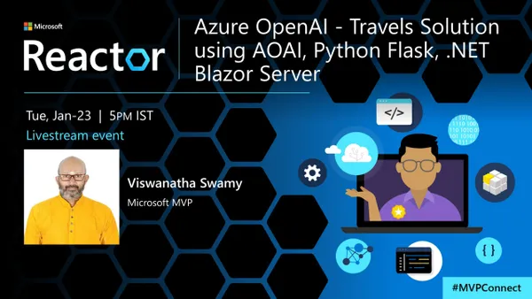
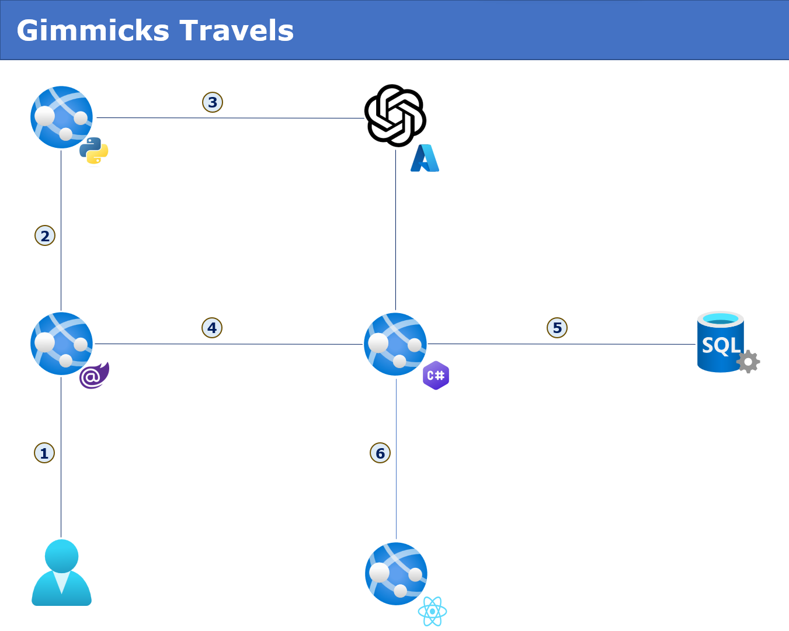

# Azure OpenAI - Travels Solution using AOAI, Python Flask, .NET Blazor Server

## Date Time: 23-Jan-2024 at 05:00 PM IST

## Event URL: [https://www.meetup.com/microsoft-reactor-bengaluru/events/297809304](https://www.meetup.com/microsoft-reactor-bengaluru/events/297809304)

## YouTube URL: [https://www.youtube.com/watch?v=2D3SnQG0OUE](https://www.youtube.com/watch?v=2D3SnQG0OUE)

## MS Learn Module: [https://aka.ms/Buildnaturallanguagesolutions](https://aka.ms/Buildnaturallanguagesolutions)



---

### Software/Tools

> 1. OS: Windows 10/11 x64
> 1. Python / .NET 8
> 1. Visual Studio 2022
> 1. Visual Studio Code

### Prior Knowledge

> 1. Programming knowledge in C# / Python
> 1. Microservices / Distributed applications
> 1. Azure / Azure Open AI

## Technology Stack

> 1. .NET 8, Python, Azure

## Information


## What are we doing today?

> 1. The Big Picture
>    - Pre-requisites
>    - Previous Session
>    - Current Architecture
> 1. Python Flask API interacting with Azure Open AI
> 1. .NET 7 Blazor Server Admin Application interacting with Python Flask API
> 1. Azure SQL Server, Database, and SQL Scripts
>    - SQL Scripts
>    - Azure SQL Database, and Azure Data Studio
> 1. Creating .NET 8 Minimal API to store Countries information in Azure SQL Server
> 1. Integrating Python Flask API, .NET 7 Blazor Server Admin Application, and .NET 8 Minimal API
> 1. Creating React 18 Client Application to view information.
> 1. Integrating Python Flask API, Blazor Server Admin Application, .NET 8 Minimal API, and React 18 Client Application.
> 1. SUMMARY / RECAP / Q&A

### Please refer to the [**Source Code**](https://github.com/orgs/ViswanathaSwamy-PK-TechSkillz-Academy/repositories?q=travels) of today's session for more details

---


---

## 1. The Big Picture

### Pre-requisites

> 1. Azure Open AI, SQL
> 1. Python, and .NET 7/8

### Previous Session

> 1. <https://www.youtube.com/watch?v=9L_ebd9P-xM>

### Current Architecture



## 2. Python Flask API interacting with Azure Open AI

> 1. Discussion and Demo. This is created in previous session
> 1. New Changes
> 1. <https://learn.microsoft.com/en-gb/azure/ai-services/openai/quickstart?tabs=command-line%2Cpython-new&pivots=programming-language-python>


## 3. .NET 7 Blazor Server Admin Application interacting with Python Flask API

> 1. Discussion and Demo. This is created in previous session


## 4. Azure SQL Server, Database, and SQL Scripts

> 1. Discussion and Demo

### SQL Scripts

```sql
CREATE TABLE CountriesInfo (
    [CountryId] INT IDENTITY (1, 1) NOT NULL PRIMARY KEY,
    CountryName NVARCHAR(100),
    CapitalState NVARCHAR(100),
    NationalBird NVARCHAR(100),
    CountryPopulation BIGINT
);
```

### Azure SQL Database, and Azure Data Studio

> 1. Discussion and Demo


## 5. Creating .NET 8 Minimal API to store Countries information in Azure SQL Server

> 1. Discussion and Demo


## 6. Integrating Python Flask API, .NET 7 Blazor Server Admin Application, and .NET 8 Minimal API

> 1. Discussion and Demo


## 7. Creating React 18 Client Application to view information

> 1. Discussion and Demo


## 8. Integrating Python Flask API, .NET 7 Blazor Server Admin Application, .NET 8 Minimal API, and React 18 Client Application

> 1. Discussion and Demo


---

## 9. SUMMARY / RECAP / Q&A

> 1. SUMMARY / RECAP / Q&A
> 2. Any open queries, I will get back through meetup chat/twitter.

---
