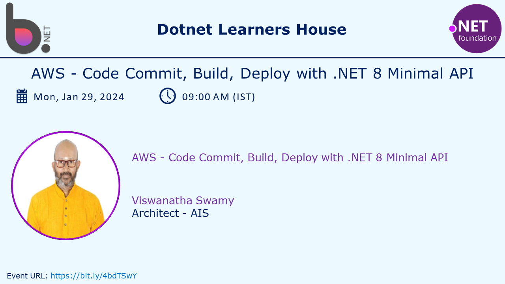
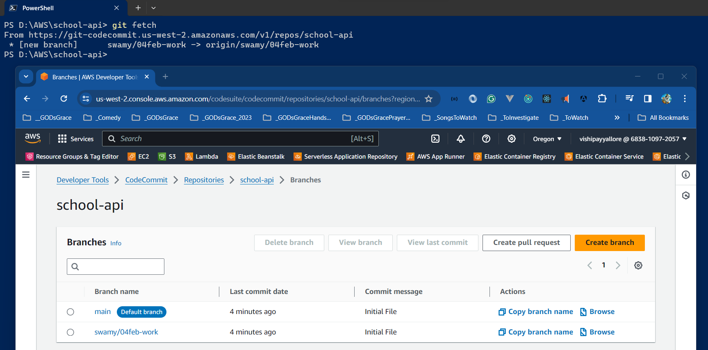
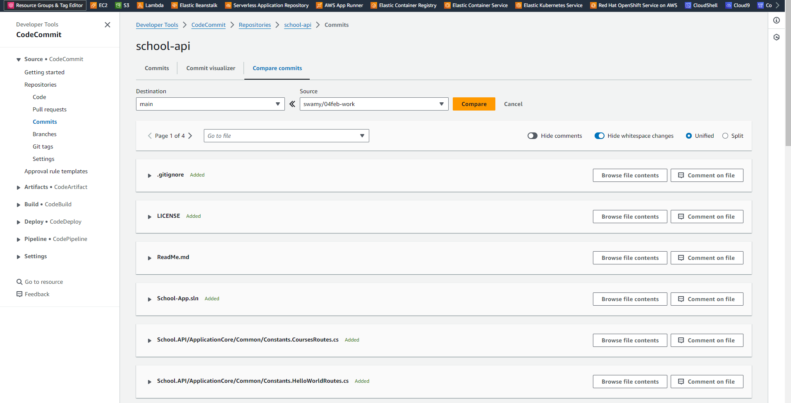

# AWS - Code Commit, Build, Deploy with .NET 8 Minimal API

## Date Time: 05-Feb-2024 at 09:00 AM IST

## Event URL: [https://www.meetup.com/dot-net-learners-house-hyderabad/events/297030488](https://www.meetup.com/dot-net-learners-house-hyderabad/events/297030488)

## YouTube URL: [https://www.youtube.com/watch?v=4A5j9gl_0uc](https://www.youtube.com/watch?v=4A5j9gl_0uc)



---

### Software/Tools

> 1. OS: Windows 10/11 x64
> 1. .NET 8
> 1. Visual Studio 2022
> 1. Visual Studio Code
> 1. AWS Cli

### Prior Knowledge

> 1. Programming knowledge in C#
> 1. Microservices / Distributed applications
> 1. AWS, CI/CD

## Technology Stack

> 1. .NET 8, C#, AWS, CI/CD

## Information


## What are we doing today?

> 1. The Big Picture
>    - Pre-requisites
>    - Previous sessions
> 1. Create .NET 8 Minimal API
>    - Discusion on .NET 8 Minimal API
>    - Execute Minimal API locally using Swagger / Postman / .http file
> 1. AWS Code Commit
>    - Check in and Check out the code
>    - Branching, Pull Request
> 1. AWS Code Build
>    - Create buildspec.yml
>    - Build the repo
>    - Store artifacts
>    - Download the artifacts and verify
> 1. Preparing EC2 instance for deployment
>    - Creating a new Ubuntu EC2 Instance
>    - Installing required software (wget, .NET 8 runtime)
>    - Installing code deploy agent
> 1. AWS Code Deploy
>    - Create appspec.yml file
>    - Use Code Deploy to deploy the latest binaries to EC2
>    - Verify the deployed Minimal API using EC2's public IP / DNS
> 1. SUMMARY / RECAP / Q&A

### Please refer to the [**Source Code**](https://github.com/ViswanathaSwamy-PK-TechSkillz-Academy/minimal-apis) of today's session for more details

---


---

## 1. The Big Picture

### Pre-requisites

> 1. AWS
> 1. .NET 8

### Previous Session

> 1. Code Commit <https://www.youtube.com/watch?v=h6l1GoE8qfw>
> 1. Code Build <https://www.youtube.com/watch?v=hS2CTmgVNK4>

### Big Picture Look


## 2. Create .NET 8 Minimal API

> 1. Discussion and Demo

### Discusion on .NET 8 Minimal API

> 1. Discussion and Demo


### Execute Minimal API locally using Swagger / Postman / .http file

> 1. Discussion and Demo


## 3. AWS Code Commit

> 1. Discussion and Demo

### Create Repository for the project code

> 1. Discussion and Demo


### Check in and Check out the code

> 1. Discussion and Demo


### Branches and Feature Branch

> 1. Discussion and Demo



### Feature development, and Commits

> 1. Discussion and Demo



### Pull Request and Merge

> 1. Discussion and Demo


## 4. AWS Code Build

> 1. Discussion and Demo

### Create the Code Build Project

> 1. Discussion and Demo


### Create buildspec.yml

> 1. Discussion and Demo

#### Verify the Commands locally


#### buildspec.yml

```yml
version: 0.2

phases:
  install:
    runtime-versions:
      dotnet: 8.0
    commands:
      - curl -sSL https://dot.net/v1/dotnet-install.sh | bash /dev/stdin --channel 8.0
  pre_build:
    commands:
      - echo Nothing to do in the pre_build phase...
  build:
    commands:
      - echo Build started on `date`
      - dotnet restore ./School-App.sln
      - dotnet build ./School-App.sln
      - dotnet publish  ./School-App.sln -c Release -o target
  post_build:
    commands:
      - echo Build completed on `date`
artifacts:
  files:
    - target/**/*
    - appspec.yml
    - Scripts/**/*
```

### Build the repo

> 1. Discussion and Demo


### Download the artifacts and verify

> 1. Discussion and Demo

## 5. Preparing EC2 instance for deployment

> 1. Discussion and Demo

### Creating a new Ubuntu EC2 Instance

> 1. Discussion and Demo

### Installing required software (wget, .NET 8 runtime)

> 1. Discussion and Demo

### Installing code deploy agent

> 1. Discussion and Demo

## 6. AWS Code Deploy

> 1. Discussion and Demo

### Code Deploy - Application, and Deploy Group


### Create appspec.yml file

> 1. Discussion and Demo

### Use Code Deploy to deploy the latest binaries to EC2

> 1. Discussion and Demo

### Verify the deployed Minimal API using EC2's public IP / DNS

> 1. Discussion and Demo

---

## X. SUMMARY / RECAP / Q&A

> 1. SUMMARY / RECAP / Q&A
> 2. Any open queries, I will get back through meetup chat/twitter.

---
