# Microservices Series - MS SQL Server, Docker, Azure Data Studio, .NET 8, and EF Core

## Date Time: 22-Feb-2024 at 09:00 AM IST

## Event URL: [https://www.meetup.com/dot-net-learners-house-hyderabad/events/297294484](https://www.meetup.com/dot-net-learners-house-hyderabad/events/297294484)

## YouTube URL: [https://www.youtube.com/watch?v=ToBeDone](https://www.youtube.com/watch?v=ToBeDone)

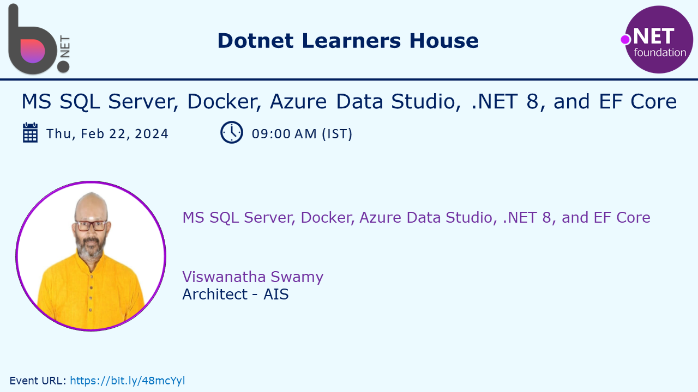

---

### Software/Tools

> 1. OS: Windows 10/11 x64
> 1. .NET 8
> 1. Visual Studio 2022
> 1. Visual Studio Code
> 1. Azure CLI
> 1. Docker

### Prior Knowledge

> 1. Programming knowledge in C#
> 1. Microservices / Distributed applications
> 1. Azure, MS SQL

## Technology Stack

> 1. .NET 8, C#, Azure, MS SQL

## Information


## What are we doing today?

> 1. The Big Picture
> 1. Creating SQL Database Project
> 1. Creating SQL Database in MS Sql Local Db
> 1. Creating SQL Database in Docker
> 1. Creating SQL Database in Azure
> 1. Deploying SQL using VS 2022
> 1. Accessing SQL Database in VS 2022, VS Code, and Azure Data Studio
> 1. Creating Simple Console Application to access SQL database using EF Core
> 1. SUMMARY / RECAP / Q&A

### Please refer to the [**Source Code To Be Done**](https://github.com/ViswanathaSwamy-PK-TechSkillz-Academy/minimal-apis) of today's session for more details

---


---

## 1. The Big Picture

### Pre-requisites

> 1. Azure
> 1. Docker
> 1. .NET 8
> 1. VS 2022, VS Code, Azure Data Studio

### Previous Session

> 1. Playlist <https://www.youtube.com/watch?v=R6_4ZoqiwDk&list=PLdLQDTLMjAzq4EASDtbRkgIVhDAlb8drR>

### Big Picture Look

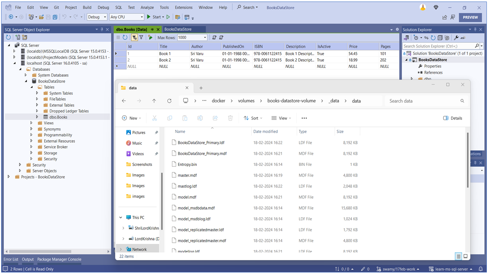

## 2. Creating SQL Database Project

> 1. Discussion and Demo
> 1. <https://learn.microsoft.com/en-us/azure-data-studio/extensions/sql-database-project-extension>

### Creating the .sqlproj

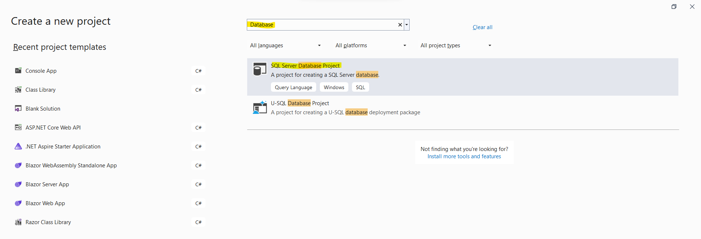

### Creating the database objects

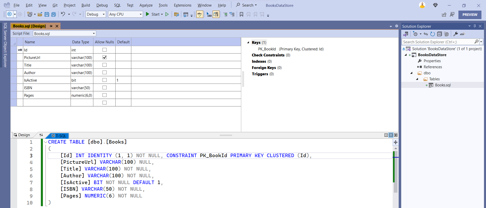

### Creating the Seed Data

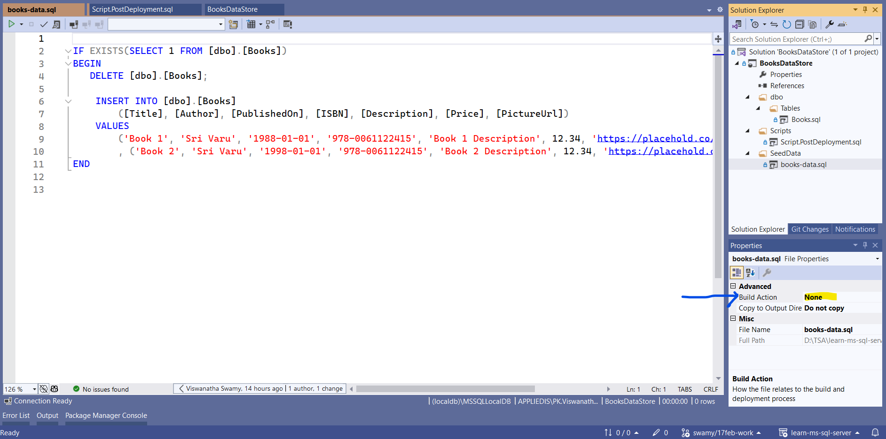

### Creating the post deployment scripts

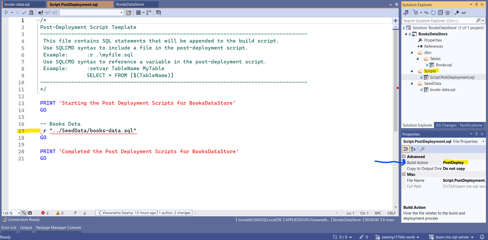

## 3. Creating SQL Database in MS Sql Local Db

> 1. Discussion and Demo

### Project Settings

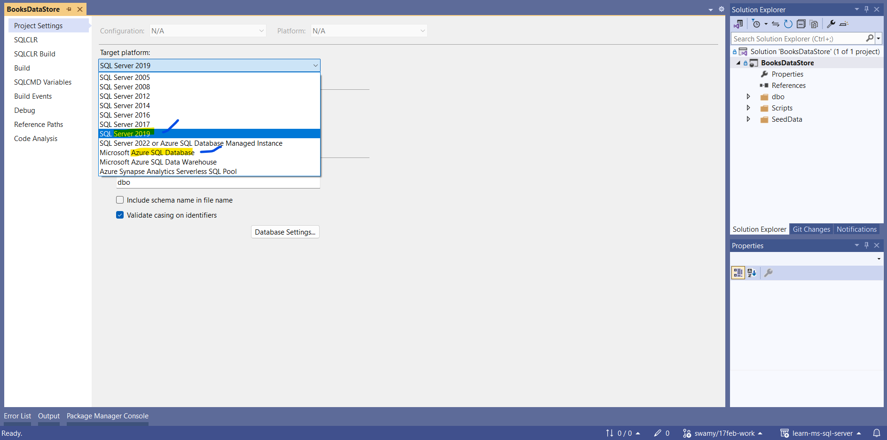

### MS Sql Local Db Connection String

```text
Data Source=(localdb)\MSSQLLocalDB;Initial Catalog=BooksDataStore;Integrated Security=True;Persist Security Info=False;Pooling=False;Multiple Active Result Sets=False;Connect Timeout=60;Encrypt=True;Trust Server Certificate=False;Command Timeout=0
```

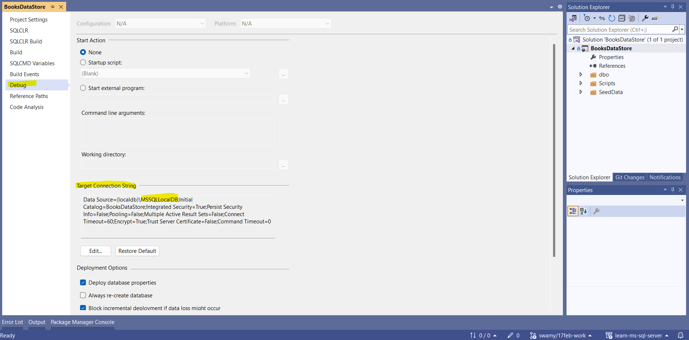

### Deployment to MS Sql Local Db

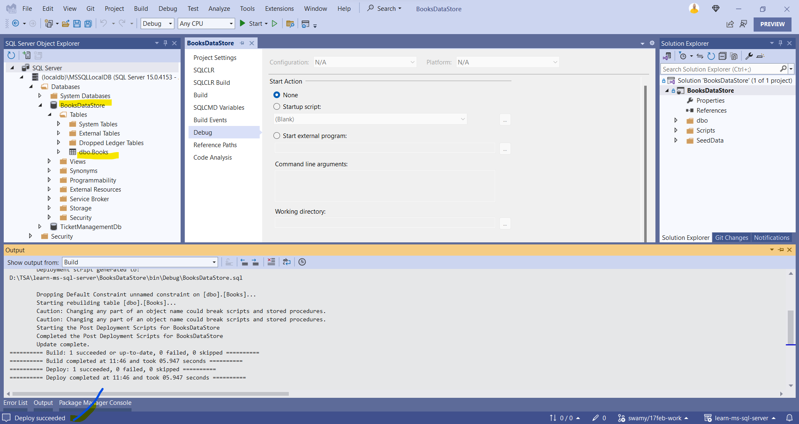

## 4. Creating SQL Database in a Docker Container

> 1. Discussion and Demo
> 1. <https://learn.microsoft.com/en-us/sql/linux/sql-server-linux-docker-container-configure?view=sql-server-ver16&pivots=cs1-bash>
> 1. Physical path of docker volumes `\\wsl$\docker-desktop-data\data\docker\volumes`

### Creating SQL Server 2022 docker container with Volume

```bash
docker run -e "ACCEPT_EULA=Y" -e "MSSQL_SA_PASSWORD=YourStrongPassword@1" -p 1433:1433 --name books-datastore --hostname books-datastore -e 'MSSQL_PID=Standard' -v books-datastore-volume:/var/opt/mssql -d mcr.microsoft.com/mssql/server:2022-latest

docker volume ls
```

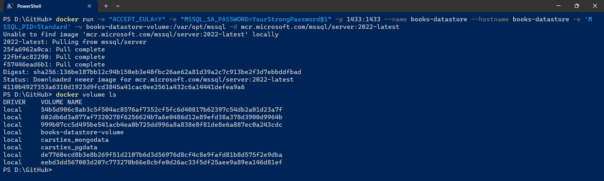

### Deployment to MS Sql inside docker

```text
Data Source=localhost;Initial Catalog=BooksDataStore;Persist Security Info=False;User ID=sa;Pooling=False;Multiple Active Result Sets=False;Connect Timeout=60;Encrypt=True;Trust Server Certificate=True;Command Timeout=0
```

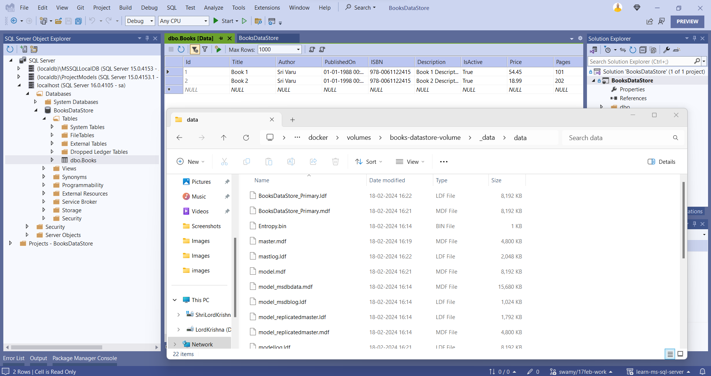

## 5. Creating SQL Database in Azure

> 1. Discussion and Demo

---

## X. SUMMARY / RECAP / Q&A

> 1. SUMMARY / RECAP / Q&A
> 2. Any open queries, I will get back through meetup chat/twitter.

---
