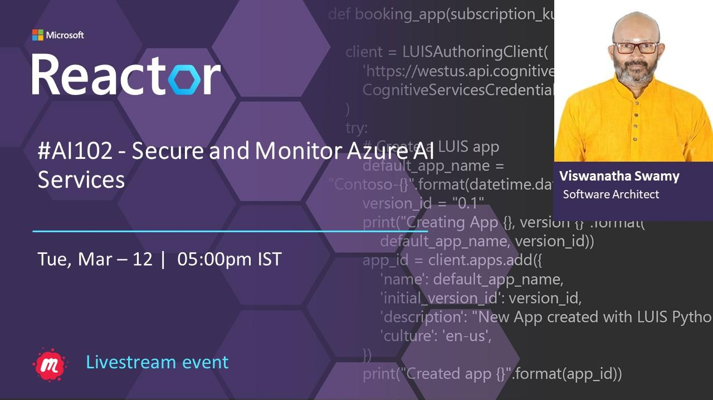

# AI 102 - Secure and Monitor Azure AI Services

## Date Time: 12-Mar-2024 at 05:00 PM IST

## Event URL: [https://www.meetup.com/microsoft-reactor-bengaluru/events/299209829](https://www.meetup.com/microsoft-reactor-bengaluru/events/299209829)

## YouTube URL: [https://www.youtube.com/watch?v=ToBeDone](https://www.youtube.com/watch?v=ToBeDone)

## MS Learn Module(s)

> 1. <https://aka.ms/MonitorAzureAIservices>
> 1. <https://aka.ms/SecureAzureAIservices>



---

### Software/Tools

> 1. OS: Windows 10/11 x64
> 1. Python / .NET 8
> 1. Visual Studio 2022
> 1. Visual Studio Code

### Prior Knowledge

> 1. Programming knowledge in C# / Python
> 1. Microservices / Distributed applications
> 1. Azure / Azure Open AI

## Technology Stack

> 1. .NET 8, Python, Azure

## Information


## What are we doing today?

> 1. The Big Picture
>    - Pre-requisites
>    - Previous Session
>    - Current Architecture
> 1. Study guide for Exam AI-102
> 1. What is Intelligence?
> 1. Few Terms AI, ML, Auto ML, DL, NLP, GAI
> 1. ELIZA - The early Natural Language Processing (NLP) Chatbot
> 1. Azure Open AI, Transformer and GPT
> 1. Prepare to develop AI solutions on Azure
> 1. Create and consume Azure AI services
> 1. SUMMARY / RECAP / Q&A

### Please refer to the [**Source Code**](https://github.com/vishipayyallore/aiml-2024/tree/main/ai102demos/TextAnalyticsDemos) of today's session for more details

---


---

## 1. The Big Picture

### Pre-requisites

> 1. Azure Open AI, AI/ML
> 1. Python, C#, and .NET 8

### Previous Session

> 1. <https://www.youtube.com/watch?v=03dh8I5FZpo>

### Current Architecture

> 1. NA

## 2. Prepare to develop AI solutions on Azure

> 1. Discussion and Demo
> 1. <https://learn.microsoft.com/en-us/training/modules/prepare-to-develop-ai-solutions-azure/>

## 3. Create and consume Azure AI services

> 1. Discussion and Demo
> 1. <https://learn.microsoft.com/en-us/training/modules/create-manage-ai-services/>
> 1. <https://microsoftlearning.github.io/mslearn-ai-services/Instructions/Exercises/01-use-azure-ai-services.html>


### Virtual Environment Creation

```powershell
pip install virtualenv
python -m venv .venv
.venv/Scripts/activate
pip freeze
deactivate
```

```powershell
pip install python-dotenv
pip install azure-ai-textanalytics==5.3.0
```


---

## X. SUMMARY / RECAP / Q&A

> 1. SUMMARY / RECAP / Q&A
> 2. Any open queries, I will get back through meetup chat/twitter.

---
