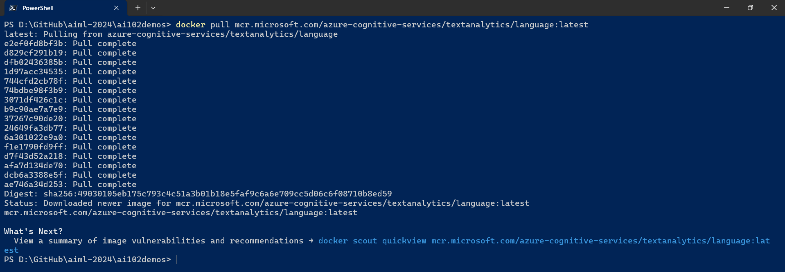
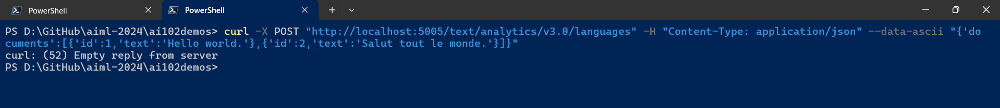
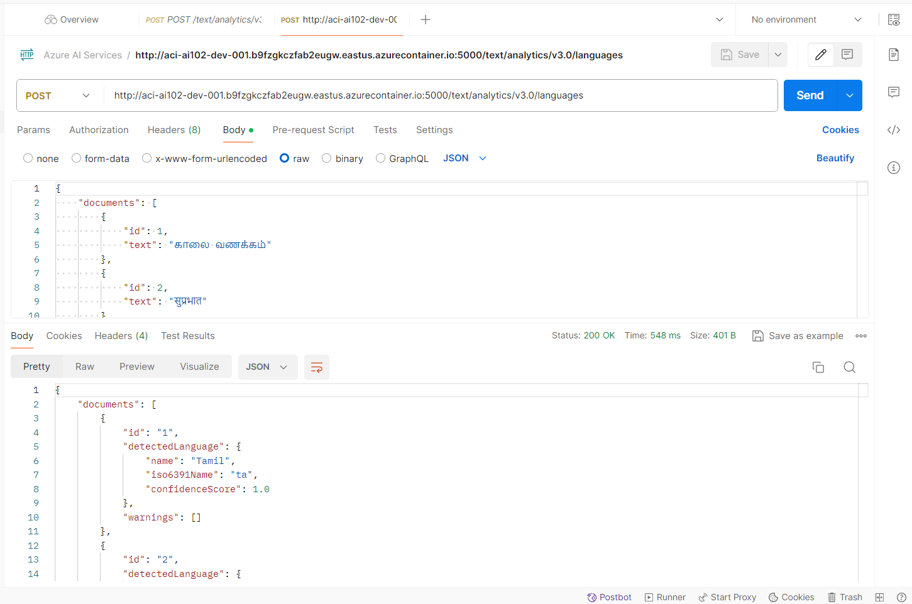

# AI 102 - Build decision support with Azure AI Services

## Date Time: 26-Mar-2024 at 05:00 PM IST

## Event URL: [https://www.meetup.com/microsoft-reactor-bengaluru/events/299375177](https://www.meetup.com/microsoft-reactor-bengaluru/events/299375177)

## YouTube URL: [https://www.youtube.com/watch?v=ToBeDone](https://www.youtube.com/watch?v=ToBeDone)

## MS Learn Module(s)

> 1. <https://aka.ms/AIservicesincontainers>
> 1. <https://aka.ms/Azure-ContentModerator>


---

### Software/Tools

> 1. OS: Windows 10/11 x64
> 1. Python / .NET 8
> 1. Visual Studio 2022
> 1. Visual Studio Code

### Prior Knowledge

> 1. Programming knowledge in C# / Python
> 1. Microservices / Distributed applications
> 1. Azure / Azure Open AI

## Technology Stack

> 1. .NET 8, Python, Azure

## Information


## What are we doing today?

> 1. The Big Picture
>    - Pre-requisites
>    - Previous Session
>    - Current Architecture
> 1. Deploy Azure AI services in containers
>    - `Docker` installed Locally
>    - Provision an Azure AI Services resource
>    - Retrieving AI Services Keys
>    - Deploy and run a Text Analytics container on Local Docker
>    - Verify Local Docker Container using `Browser`
>    - Verify Local Docker Container using `CURL`
>    - Deploy and run a Text Analytics container on Azure Container Instance
>    - Verify Text Analytics container on Azure Container Instance using `CURL`
>    - Verify Text Analytics container on Azure Container Instance using `Postman`
>    - Verify Text Analytics container on Azure Container Instance using `Python` Program
> 1. Classify and moderate text with Azure Content Moderator
> 1. SUMMARY / RECAP / Q&A

### Please refer to the [**Source Code**](https://github.com/vishipayyallore/aiml-2024/tree/main/ai102demos) of today's session for more details

---


---

## 1. The Big Picture

### Pre-requisites

> 1. Azure Open AI, AI/ML
> 1. Python, C#, and .NET 8

### Previous Session

> 1. <https://www.youtube.com/watch?v=03dh8I5FZpo>
> 1. <https://www.youtube.com/watch?v=XJS_9O4WePs>

### Current Architecture

> 1. NA

## 2. Deploy Azure AI services in containers

> 1. Discussion and Demo
> 1. <https://learn.microsoft.com/en-gb/training/modules/investigate-container-for-use-with-ai-services/1-introduction>
> 1. <https://microsoftlearning.github.io/mslearn-ai-services/Instructions/Exercises/04-use-a-container.html>
> 1. <https://learn.microsoft.com/en-us/azure/ai-services/cognitive-services-container-support>
> 1. <https://learn.microsoft.com/en-us/azure/ai-services/language-service/overview#deploy-on-premises-using-docker-containers>
> 1. <https://learn.microsoft.com/en-us/azure/ai-services/language-service/language-detection/how-to/use-containers>

### `Docker` installed Locally

> 1. Discussion and Demo

### Provision an Azure AI Services resource

> 1. Discussion and Demo

### Retrieving AI Services Keys

> 1. Discussion and Demo

```powershell
$rgname="rg-ai102-dev-001"
$aaisvs="azais-ai102-dev-002"

az cognitiveservices account keys list --name $aaisvs --resource-group $rgname

az cognitiveservices account keys regenerate --name $aaisvs --resource-group $rgname --key-name key1
```

### Deploy and run a Text Analytics container on Local Docker

> 1. Discussion and Demo

#### Pull in docker image

```powershell
docker pull mcr.microsoft.com/azure-cognitive-services/textanalytics/language:latest
```



#### Running the docker image

```powershell
docker run --rm -it -p 5005:5000 --memory 4g --cpus 1 mcr.microsoft.com/azure-cognitive-services/textanalytics/language Eula=accept Billing="YourEndpoint.cognitiveservices.azure.com/" ApiKey="YourKey"
```

### Verify Local Docker Container using `Browser`


### Verify Local Docker Container using `CURL`

> 1. Discussion and Demo

```powershell
curl -X POST "http://localhost:5005/text/analytics/v3.0/languages" -H "Content-Type: application/json" --data-ascii "{'documents':[{'id':1,'text':'காலை வணக்கம்'},{'id':2,'text':'Salut tout le monde.'}]}"
```



### Deploy and run a Text Analytics container on Azure Container Instance

> 1. Discussion and Demo


### Verify Text Analytics container on Azure Container Instance using `CURL`

> 1. Discussion and Demo

```powershell
curl -X POST "http://aci-ai102-dev-001.b9fzgkczfab2eugw.eastus.azurecontainer.io:5000/text/analytics/v3.0/languages" -H "Content-Type: application/json" --data-ascii "{'documents':[{'id':1,'text':'காலை வணக்கம்'},{'id':2,'text':'Salut tout le monde.'}]}"
```


### Verify Text Analytics container on Azure Container Instance using `Postman`

> 1. Discussion and Demo



### Verify Text Analytics container on Azure Container Instance using `Python` Program

> 1. Discussion and Demo


## 3. Classify and moderate text with Azure Content Moderator

> 1. Discussion and Demo
> 1. <https://learn.microsoft.com/en-gb/training/modules/classify-and-moderate-text-with-azure-content-moderator/>
> 1. <https://learn.microsoft.com/en-gb/training/modules/classify-and-moderate-text-with-azure-content-moderator/4-exercise-use-the-api-console>


---

## X. SUMMARY / RECAP / Q&A

> 1. SUMMARY / RECAP / Q&A
> 2. Any open queries, I will get back through meetup chat/twitter.

---
