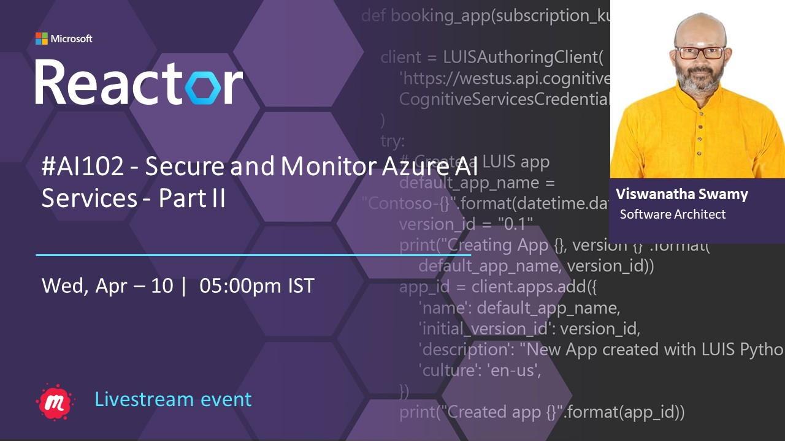

# AI 102 - Secure and Monitor Azure AI Services - Part II

## Date Time: 10-Apr-2024 at 05:00 PM IST

## Event URL: [https://www.meetup.com/microsoft-reactor-bengaluru/events/299764723](https://www.meetup.com/microsoft-reactor-bengaluru/events/299764723)

## YouTube URL: [https://www.youtube.com/watch?v=ToBeDone](https://www.youtube.com/watch?v=ToBeDone)

## MS Learn Module(s)

> 1. <https://aka.ms/MonitorAzureAIservices>
> 1. <https://aka.ms/SecureAzureAIservices>



---

### Software/Tools

> 1. OS: Windows 10/11 x64
> 1. Python / .NET 8
> 1. Visual Studio 2022
> 1. Visual Studio Code

### Prior Knowledge

> 1. Programming knowledge in C# / Python
> 1. Microservices / Distributed applications
> 1. Azure / Azure Open AI

## Technology Stack

> 1. .NET 8, Python, Azure

## Information


## What are we doing today?

> 1. The Big Picture
>    - Pre-requisites
>    - Previous Session
>    - Current Architecture
> 1. Manage Azure AI Services Security
> 1. Monitor Azure AI Services
> 1. SUMMARY / RECAP / Q&A

### Please refer to the [**Source Code**](https://github.com/vishipayyallore/aiml-2024/tree/main/ai102demos/TextAnalyticsDemos) of today's session for more details

---


---

## 1. The Big Picture

### Pre-requisites

> 1. Azure Open AI, AI/ML
> 1. Python, C#, and .NET 8

### Previous Session

> 1. <https://www.youtube.com/watch?v=03dh8I5FZpo>
> 1. <https://www.youtube.com/watch?v=XJS_9O4WePs>
> 1. <https://www.youtube.com/watch?v=EGP_t1xjpr4>

### Current Architecture

> 1. NA

## 2. Manage Azure AI Services Security

> 1. Discussion and Demo
> 1. <https://microsoftlearning.github.io/mslearn-ai-services/Instructions/Exercises/02-ai-services-security.html>

### Provision an Azure AI Services resource

> 1. Discussion and Demo
> 1. Azure AI services multi-service account
> 1. Resource Group name `rg-ai102-dev-001`
> 1. Azure AI Services name `azaisvc-ai102-dev-001`


### Retrieve the `Endpoint` and `key`

> 1. Discussion and Demo
> 1. Please place these inside your `secrets.json` which is outside your source code location, OR `appsettings.json` which is placed inside `.gitignore`
> 1. Please create an `appsettings.example.json` for reference.
> 1. Please place these inside your `.env` file.
> 1. Please create an `example.env` for reference.
> 1. Environment Variables is also another option.


### Quick test of `Azure AI service` using Postman

> 1. Discussion and Demo


## Manage authentication keys

> 1. Discussion and Demo
> 1. Using Azure Portal, and Azure CLI
> 1. Test the `curl` command after regenerating the `key1`

```powershell
$rgname="rg-ai102-dev-001"
$azaisvc="azaisvc-ai102-dev-001"

az cognitiveservices account keys list --name $azaisvc --resource-group $rgname

az cognitiveservices account keys regenerate --name $azaisvc --resource-group $rgname --key-name key1
```


### Secure key access with Azure Key Vault

> 1. Discussion and Demo
> 1. Discussion on `Soft Delete`, and `Purge Protection`

#### Create a `key vault`

> 1. Discussion and Demo


#### Add Azure AI Services `key` as secret into `key vault`

> 1. Discussion and Demo

#### Create a service principal

> 1. Discussion and Demo

```powershell
az ad sp create-for-rbac -n "api://<spName>" --role owner --scopes subscriptions/<subscriptionId>/resourceGroups/<resourceGroup>

az ad sp show --id <appId>

az keyvault set-policy -n <keyVaultName> --object-id <objectId> --secret-permissions get list
```

## 4. Monitor Azure AI Services

> 1. Discussion and Demo
> 1. <https://microsoftlearning.github.io/mslearn-ai-services/Instructions/Exercises/03-monitor-ai-services.html>

---

## X. SUMMARY / RECAP / Q&A

> 1. SUMMARY / RECAP / Q&A
> 2. Any open queries, I will get back through meetup chat/twitter.

---
