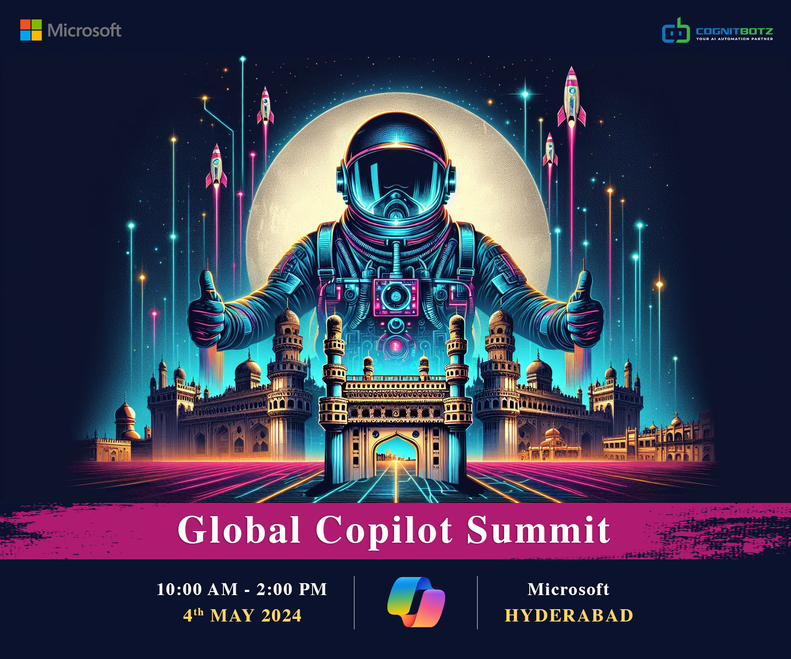
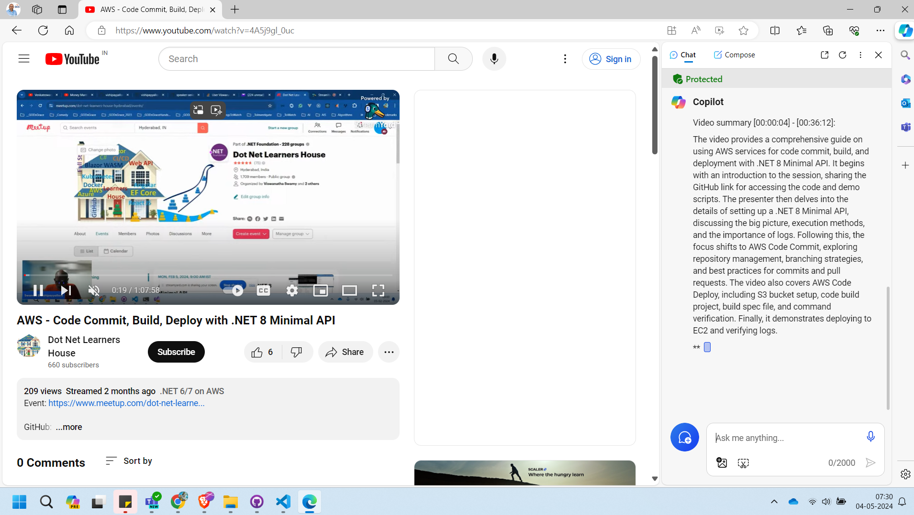
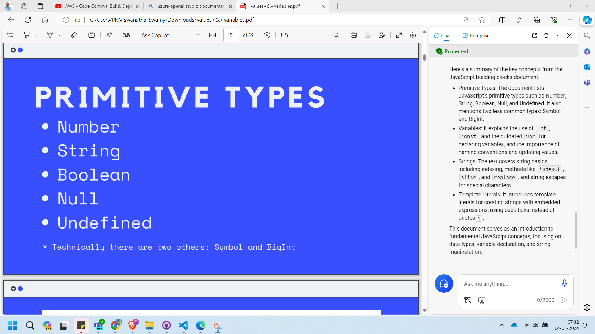

# Global Copilot Developer Summit 2024 - Hyderabad

## Date Time: 04-May-2024 at 10:00 AM IST

## Event URL: [https://www.linkedin.com/feed/update/urn:li:activity:7183811218778849281/](https://www.linkedin.com/feed/update/urn:li:activity:7183811218778849281/)

## YouTube URL: [https://www.youtube.com/watch?v=ToBeDone](https://www.youtube.com/watch?v=ToBeDone)

Could you please summerize this "Microsoft for Startups Founders Club Ep. 3" video from Microsoft Reactor

---

### Software/Tools

> 1. OS: Windows 10/11 x64
> 1. Microsoft Account
> 1. Chrome / Edge Browser

### Prior Knowledge

> 1. Programming knowledge in C# / Python
> 1. Microservices / Distributed applications
> 1. Azure / Azure Open AI

## Technology Stack

> 1. AI, Azure Open AI, Open AI

## Information

## What are we doing today?

> 1. The Big Picture
> 1. To be done
> 1. SUMMARY / RECAP / Q&A

### Please refer to the [**Source Code**](https://github.com/vishipayyallore/speaker-series-2024/tree/main/0504_GlobalCopilotDeveloperSummit) of today's session for more details

---

---

## 1. The Big Picture

> 1. Discussion

## 2. Copilot for Web

> 1. Conversational AI Chatbot powered by Bing
> 1. Powered by Open AI's GPT-4 LLM. Chat Generative Pre-trained Transformer
> 1. **Chat GPT-4** is an advanced language model developed by OpenAI. It builds upon its predecessors, incorporating improvements in architecture, training data, and fine-tuning techniques. Chat GPT-4 is capable of understanding context, generating coherent responses, and assisting users across a wide range of tasks, making it a powerful tool for natural language understanding and generation. Its underlying neural network architecture, based on transformer models, allows it to handle complex language patterns and relationships, making it a valuable asset for various applications in text generation, chatbots, and more
> 1. **Large Language Model (LLM)** is an artificial intelligence algorithm that employs neural network techniques with a large number of parameters to process and understand human languages or text using self-supervised learning. These models are highly efficient in capturing complex entity relationships in text and can be used for tasks like text generation, machine translation, chatbots, and more. LLMs operate on the principles of deep learning, leveraging neural network architectures and attention mechanisms to learn intricate patterns and relationships from diverse language data during training. Examples of LLMs include Chat GPT by OpenAI and BERT by Google

### Microsoft Copilot Suite

> 1. Microsfot Copilot for Web
> 1. Microsfot Copilot for M365
> 1. Microsfot Copilot for Power Platform
> 1. Microsfot Copilot for sales etc

### How do I access?

> 1. It is available in Windows 11.
> 1. We can use in browsers example: Edge, Chrome, Brave.
> 1. Simply Navigate to this <https://copilot.microsoft.com/> URL.
> 1. Using Microsoft Copilot in Edge will give us additional capabilities.

### Microsoft Copilot Tiers

> 1. **Demo Time**
> 1. Free without sign in
> 1. Free with sign in with Microsoft's account
> 1. Microsoft Copilot Pro
> 1. Microsoft Copilot with Commercial Data Protection

### Prompt Engineering to interact with Microsoft Copilot

> 1. Prompt Engineering | Clear and specific | Give examples
> 1. Goal | Context | Source | Expectations
> 1. Verify the output's accuracy

### Coversational Style

> 1. Creative | Balanced | Precise

### Gettings Answers, Create Content, and Summaization

> 1. Discussion and Demo

#### Summarize Youtube Video

#### Summarize Azure documentation web page

#### Summarize a local PDF document

### Generating Images

> 1. Discussion and Demo

### Generating Code

> 1. Discussion and Demo

## 3. Copilot and GitHub Copilot for Web Development

> 1. Discussion and Demo

---

## X. SUMMARY / RECAP / Q&A

> 1. SUMMARY / RECAP / Q&A
> 2. Any open queries, I will get back through meetup chat/twitter.

---
