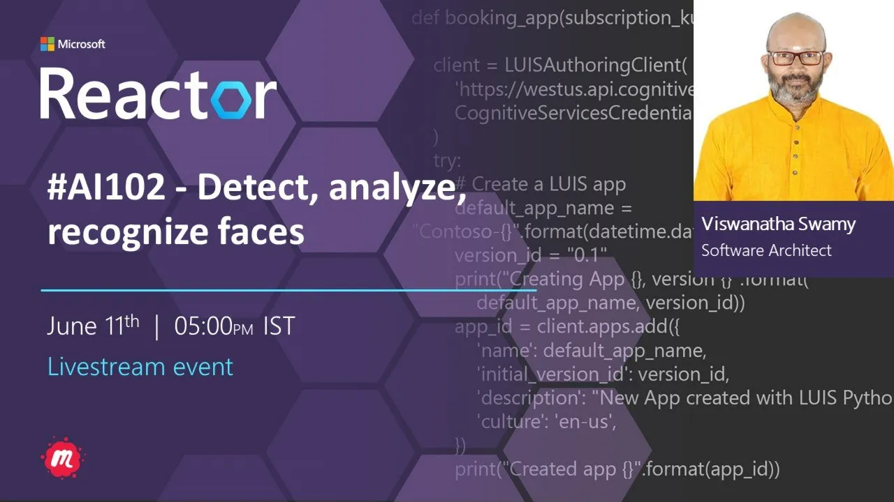
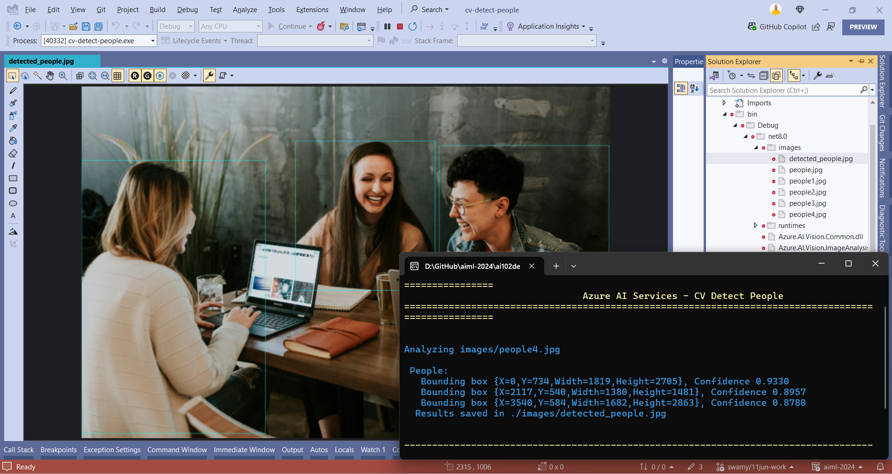
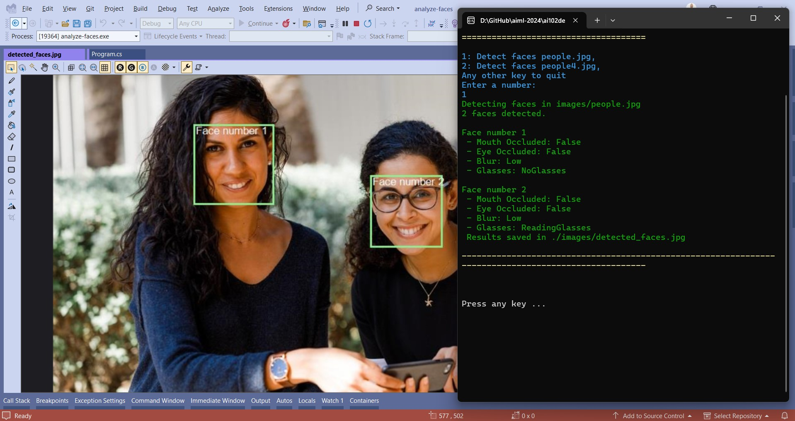

# AI 102 - Detect, analyze, recognize faces

## Date Time: 11-Jun-2024 at 05:00 PM IST

## Event URL: [https://www.meetup.com/microsoft-reactor-bengaluru/events/300324886](https://www.meetup.com/microsoft-reactor-bengaluru/events/300324886)

## YouTube URL: [https://www.youtube.com/watch?v=aJXy1RYpLVQ](https://www.youtube.com/watch?v=aJXy1RYpLVQ)

## MS Learn Module(s)

> 1. <https://aka.ms/Detect/analyze/recognize-faces>

---

### Software/Tools

> 1. OS: Windows 10/11 x64
> 1. Python / .NET 8
> 1. Visual Studio 2022
> 1. Visual Studio Code

### Prior Knowledge

> 1. Programming knowledge in C# / Python
> 1. Microservices / Distributed applications
> 1. Azure / Azure Open AI

## Technology Stack

> 1. .NET 8, Python, Azure

## Information

## What are we doing today?

> 1. The Big Picture
>    - Pre-requisites
>    - Previous Session
>    - Current Architecture
> 1. Provision an Azure AI Services resource
>    - Retrieve the Endpoint and key
> 1. Image Analysis Query from previous session
> 1. Read Text in images and documents with the Azure AI Vision Service
>    - Working with Vision Studio
>    - Working with Read REST API in Postman
>    - Working with Azure AI Vision SDK
>    - Working with Azure AI Vision Read Container
> 1. SUMMARY / RECAP / Q&A

### Please refer to the [**Source Code**](https://github.com/vishipayyallore/aiml-2024/tree/main/ai102demos) of today's session for more details

---

---

## 1. The Big Picture

> 1. <ToBeDone-Detect-Faces-Link>

### Pre-requisites

> 1. Azure Open AI, AI/ML
> 1. Python, C#, and .NET 8

### Previous Session

> 1. `Entire playlist` <https://www.youtube.com/playlist?list=PLmsFUfdnGr3wmIh-glyiMkhHS6byEuI59>

### Current Architecture

> 1. NA

## 2. Identify options for face detection analysis and identification

> 1. Discussion

## 3. Understand considerations for face analysis

> 1. Discussion

## 4. Detect faces with the Azure AI Vision service

> 1. Discussion

## 5. Understand capabilities of the face service

> 1. Discussion

## 6. Compare and match detected faces

> 1. Discussion

## 7. Implement facial recognition

> 1. Discussion

## 8. Provision an Azure AI Services resource

> 1. Discussion and Demo
> 1. Azure AI services multi-service account
> 1. Resource Group name `rg-ai102-dev-001`
> 1. Azure AI Services name `azaisvc-ai102-dev-001`

### 8.1. Retrieve the `Endpoint` and `key`

> 1. Discussion and Demo
> 1. Please place these inside your `secrets.json` which is outside your source code location, OR `appsettings.json` which is placed inside `.gitignore`
> 1. Please create an `appsettings.example.json` for reference.
> 1. Please place these inside your `.env` file.
> 1. Please create an `example.env` for reference.
> 1. Environment Variables is also another option.

## 9. Detect faces in an image using Azure AI Vision SDK

> 1. Discussion and Demo

## 10. Detect faces in an image using Face SDK

> 1. Discussion and Demo

---

## X. SUMMARY / RECAP / Q&A

> 1. SUMMARY / RECAP / Q&A
> 2. Any open queries, I will get back through meetup chat/twitter.

---
