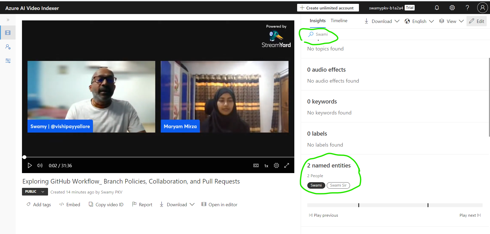

# AI 102 - Deploy Azure AI Services in Containers, ACI, and AKS

## Date Time: 09-Jul-2024 at 05:00 PM IST

## Event URL: [https://www.meetup.com/microsoft-reactor-bengaluru/events/301436944](https://www.meetup.com/microsoft-reactor-bengaluru/events/301436944)

## YouTube URL: [https://www.youtube.com/watch?v=ToBeDone](https://www.youtube.com/watch?v=ToBeDone)

## MS Learn Module(s)

> 1. <https://aka.ms/Analyzevideo>
> 1. <https://aka.ms/AIVisionService>

---

### Software/Tools

> 1. OS: Windows 10/11 x64
> 1. Python / .NET 8
> 1. Visual Studio 2022
> 1. Visual Studio Code

### Prior Knowledge

> 1. Programming knowledge in C# / Python
> 1. Microservices / Distributed applications
> 1. Azure / Azure Open AI

## Technology Stack

> 1. .NET 8, Python, Azure

## Information

## What are we doing today?

> 1. The Big Picture
>    - Pre-requisites
>    - Previous Session
>    - Current Architecture
> 1. Provision an Azure AI Services resource
>    - Retrieve the `Endpoint` and `key`
> 1. Azure Video Indexer
>    - Understand Azure Video Indexer capabilities
>    - Extract custom insights
>    - Use Video Analyzer widgets and APIs
> 1. Analyze Video using Azure Video Indexer
>    - Upload a video to Video Indexer
>    - Review video insights
>    - Search for insights
> 1. Use Video Indexer widgets
> 1. Use the Video Indexer REST API
>    - PowerShell Scripts
>    - Postman
> 1. SUMMARY / RECAP / Q&A

### Please refer to the [**Source Code**](https://github.com/vishipayyallore/aiml-2024/tree/main/ai102demos) of today's session for more details

---

---

## 1. The Big Picture

> 1. Discussion on Vision and Video Indexer

### Pre-requisites

> 1. Azure Open AI, AI/ML
> 1. Python, C#, and .NET 8

### Previous Session

> 1. `Entire playlist` <https://www.youtube.com/playlist?list=PLmsFUfdnGr3wmIh-glyiMkhHS6byEuI59>

### Current Architecture

> 1. NA

## 2. Provision an Azure AI Services resource

> 1. Discussion and Demo
> 1. Azure AI services multi-service account
> 1. Resource Group name `rg-ai102-dev-001`
> 1. Azure AI Services name `azaisvc-ai102-dev-001`

### 2.1. Retrieve the `Endpoint` and `key`

> 1. Discussion and Demo
> 1. Please place these inside your `secrets.json` which is outside your source code location, OR `appsettings.json` which is placed inside `.gitignore`
> 1. Please create an `appsettings.example.json` for reference.
> 1. Please place these inside your `.env` file.
> 1. Please create an `example.env` for reference.
> 1. Environment Variables is also another option.

## 3. Azure Video Indexer

> 1. Discussion on Azure Video Indexer from 30,000 foot view

### 3.1. Understand Azure Video Indexer capabilities

> 1. Discussion

### 3.2. Extract custom insights

> 1. Discussion

### 3.3. Use Video Analyzer widgets and APIs

> 1. Discussion
> 1. Azure Video Indexer widgets
> 1. Azure Video Indexer API

## 4. Analyze Video using Azure Video Indexer

> 1. <https://www.videoindexer.ai>

### 4.1. Upload a video to Video Indexer

> 1. Discussion

### 4.2. Review video insights

> 1. Discussion

### 4.3. Search for insights

> 1. Discussion

## 5. Use Video Indexer widgets

> 1. Discussion

## 6. Use the Video Indexer REST API

> 1. Discussion

### 6.1. PowerShell Scripts

> 1. Discussion

### 6.2. Postman

> 1. Discussion

---

## X. SUMMARY / RECAP / Q&A

> 1. SUMMARY / RECAP / Q&A
> 2. Any open queries, I will get back through meetup chat/twitter.

---
