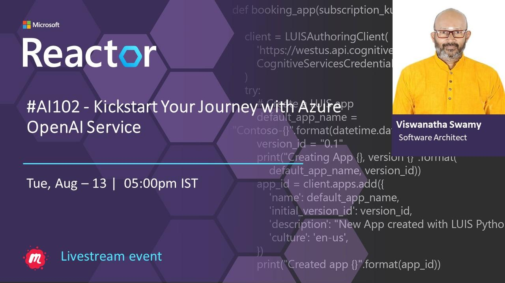

# AI 102 - Kickstart Your Journey with Azure OpenAI Service

## Date Time: 13-Aug-2024 at 05:00 PM IST

## Event URL: [https://www.meetup.com/microsoft-reactor-bengaluru/events/302151637](https://www.meetup.com/microsoft-reactor-bengaluru/events/302151637)

## YouTube URL: [https://www.youtube.com/watch?v=10QTfHsVxwk](https://www.youtube.com/watch?v=10QTfHsVxwk)

## MS Learn Module(s)

> 1. <https://aka.ms/AzureOpen-AI>



---

### Software/Tools

> 1. OS: Windows 10/11 x64
> 1. Python / .NET 8
> 1. Visual Studio 2022
> 1. Visual Studio Code

### Prior Knowledge

> 1. Programming knowledge in C# / Python
> 1. Microservices / Distributed applications
> 1. Azure / Azure Open AI

## Technology Stack

> 1. .NET 8, Python, Azure

## Information


## What are we doing today?

> 1. The Big Picture
>    - Pre-requisites
>    - Previous Session
>    - Current Architecture
> 1. Provision an Azure AI Services resource
>    - Retrieve the `Endpoint` and `key` from Portal
>    - Retrieve/Modify the `key` using PowerShell
> 1. Analyze images
> 1. OCR
> 1. SUMMARY / RECAP / Q&A

### Please refer to the [**Source Code**](https://github.com/vishipayyallore/aiml-2024/tree/main/ai102demos) of today's session for more details

---


---

## 1. The Big Picture

> 1. Kickstart Your Journey with Azure OpenAI Service

### 1.1. Pre-requisites

> 1. Azure Open AI, AI/ML
> 1. Python, C#, and .NET 8

### 1.2. Previous Session

> 1. `Entire playlist` <https://www.youtube.com/playlist?list=PLmsFUfdnGr3wmIh-glyiMkhHS6byEuI59>

### 1.3. Current Architecture

> 1. NA

## 2. Provision an Azure AI Services resource

> 1. Discussion and Demo
> 1. Azure AI services multi-service account
> 1. Resource Group name `rg-ai102-dev-001`
> 1. Azure AI Services name `azaisvc-ai102-dev-001`

### 2.1. Retrieve the `Endpoint` and `key` from Portal

> 1. Discussion and Demo
> 1. Please place these inside your `secrets.json` which is outside your source code location, OR `appsettings.json` which is placed inside `.gitignore`
> 1. Please create an `appsettings.example.json` for reference.
> 1. Please place these inside your `.env` file.
> 1. Please create an `example.env` for reference.
> 1. Environment Variables is also another option.

### 2.2. Retrieve/Modify the `key` using PowerShell

> 1. Discussion and Demo

```powershell
$rgname="rg-ai102-dev-001"
$aaisvs="aisvc-central-india-001"

az cognitiveservices account keys list --name $aaisvs --resource-group $rgname

az cognitiveservices account keys regenerate --name $aaisvs --resource-group $rgname --key-name key1
```

## 3. What is Intelligence?

> 1. Discussion

## 4. A few Terms AI, ML, Auto ML, DL, NLP, GAI

### 4.1. Artificial Intelligence (AI)

> - AI refers to the broader field of computer science focused on creating machines and software that can perform tasks that typically require human intelligence.
> - It encompasses various techniques and approaches, including machine learning and deep learning, to enable systems to reason, learn, perceive, and solve complex problems.
> - Strong / General AI: Capable of performing a wide range of tasks.
> - Narrow / Weak AI: Designed to perform specific tasks.

### 4.2. Machine Learning (ML)

> - ML is a subset of AI that involves the development of algorithms and models that allow computers to learn from data and make predictions or decisions without being explicitly programmed.
> - ML includes supervised, unsupervised, and reinforcement learning, among others, and finds applications in areas like image recognition and recommendation systems.
> - Steps: Data Collection | Data Preparation | Model Selection | Train Model | Evaluate Model | Parameter Tuning | Prediction | (GAI => New Content)

### 4.3. Deep Learning (DL)

> - DL is a subfield of ML that focuses on neural networks with many layers (deep neural networks). It handles complex, high-dimensional data, such as images and text.
> - DL has led to breakthroughs in areas like computer vision, natural language processing, and speech recognition, and it relies on large datasets and powerful hardware like GPUs.

### 4.4. Natural Language Processing (NLP)

> - NLP is a branch of AI that deals with the interaction between computers and human language. It enables machines to understand, interpret, and generate human language.
> - NLP is used in chatbots, sentiment analysis, machine translation, and more, and it involves tasks like tokenization, part-of-speech tagging, and language generation.

### 4.5. Generative AI

> - Generative AI refers to AI systems capable of generating new, original content, such as text, images, or music, often with some creativity.
> - It includes techniques like Generative Adversarial Networks (GANs) and variational autoencoders (VAEs), which have applications in art generation, content creation, and data augmentation.
> - **Generative Adversarial Networks (GANs)**
>   - GANs are a class of deep learning models consisting of two neural networks, a generator, and a discriminator, which are trained simultaneously through a competitive process.
>   - The generator aims to create data (e.g., images) that is indistinguishable from real data, while the discriminator tries to distinguish between real and generated data. This adversarial training process results in the generation of high-quality, realistic data and has applications in image generation, style transfer, and more.
> - **Variational Autoencoders (VAEs)**
>   - VAEs are another type of generative model used in unsupervised learning. They consist of an encoder network that maps input data into a latent space and a decoder network that reconstructs data from the latent space.
>   - VAEs are used for generating new data samples and learning meaningful representations of data. They are particularly useful in applications like image generation, anomaly detection, and data compression due to their ability to generate diverse and structured data from a continuous latent space.

## X. SUMMARY / RECAP / Q&A

> 1. SUMMARY / RECAP / Q&A
> 2. Any open queries, I will get back through meetup chat/twitter.

---
