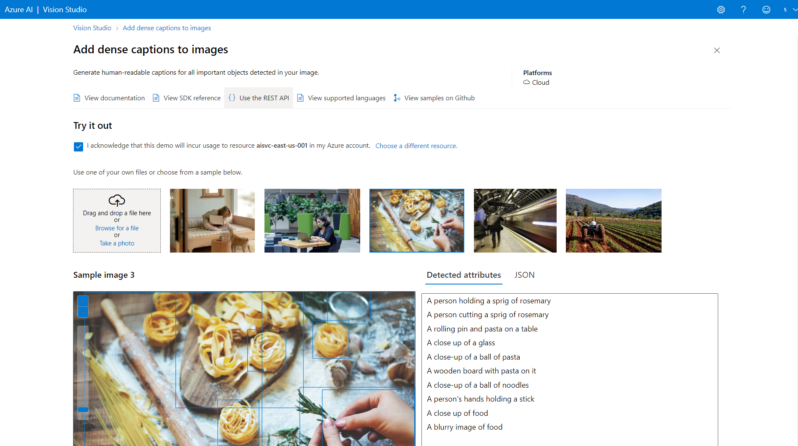
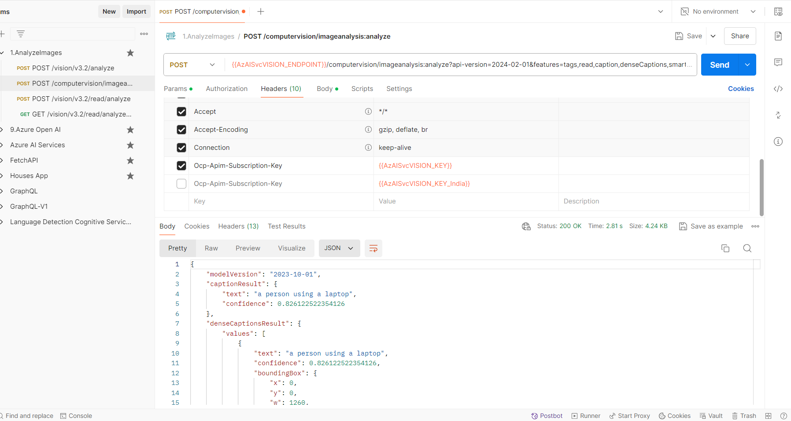
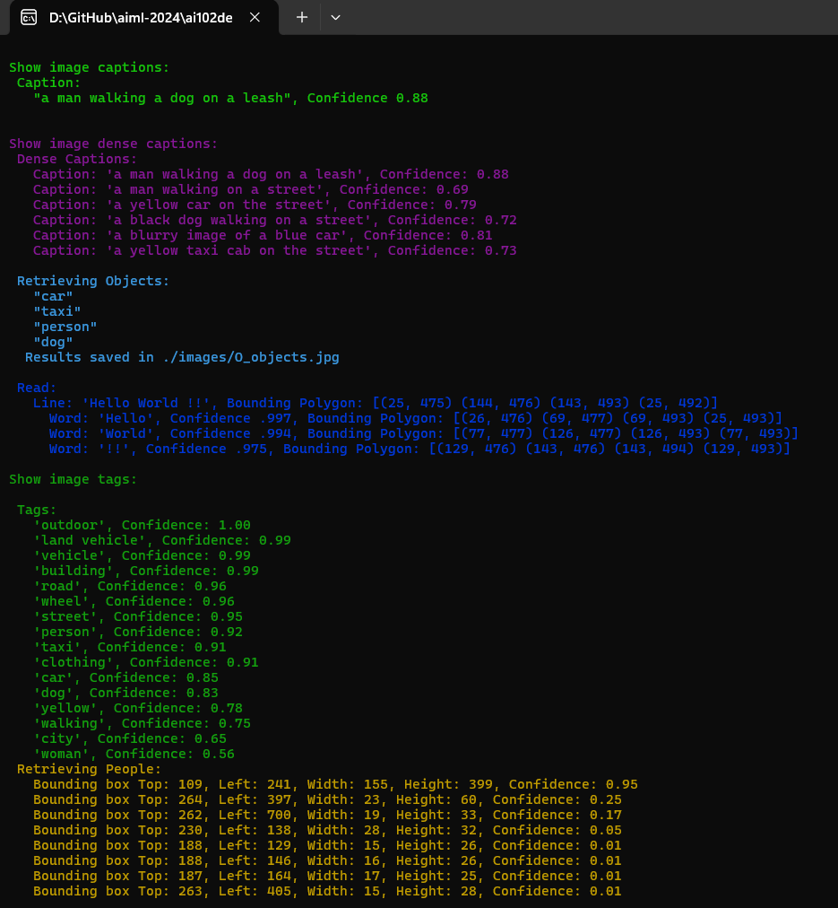
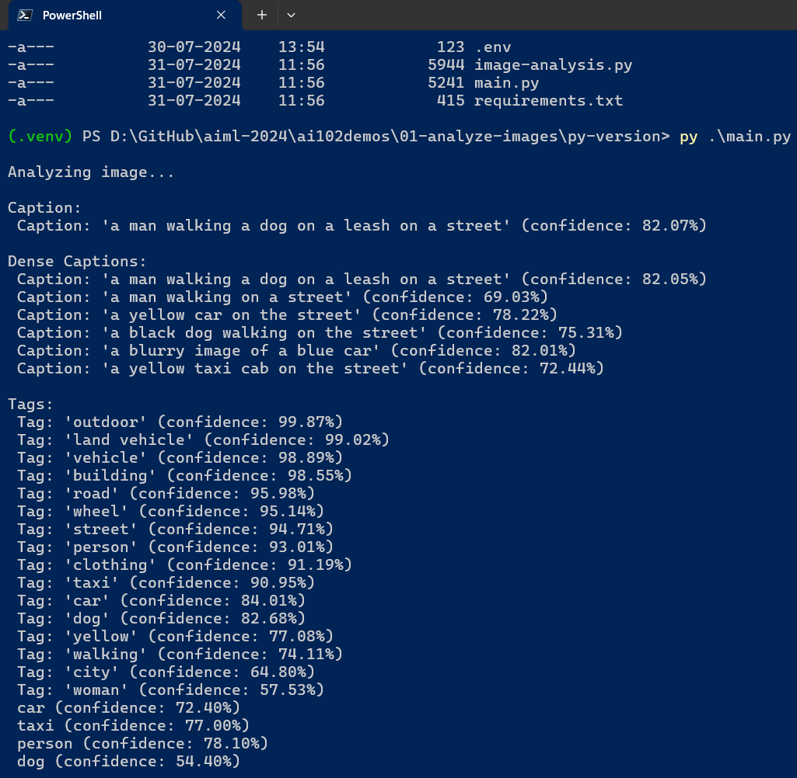

# AI 102 - Mastering Image Analysis with Azure AI Vision

## Date Time: 12-Aug-2024 at 09:00 AM IST

## Event URL: [https://www.meetup.com/dot-net-learners-house-hyderabad/events/300367723](https://www.meetup.com/dot-net-learners-house-hyderabad/events/300367723)

## YouTube URL: [https://www.youtube.com/watch?v=TiM9O5nPiHU](https://www.youtube.com/watch?v=TiM9O5nPiHU)

## MS Learn Module(s)

> 1. <https://learn.microsoft.com/en-gb/training/modules/analyze-images/>
> 1. <https://learn.microsoft.com/en-gb/training/modules/read-text-images-documents-with-computer-vision-service/>

---

### Software/Tools

> 1. OS: Windows 10/11 x64
> 1. Python / .NET 8
> 1. Visual Studio 2022
> 1. Visual Studio Code

### Prior Knowledge

> 1. Programming knowledge in C# / Python
> 1. Microservices / Distributed applications
> 1. Azure / Azure Open AI

## Technology Stack

> 1. .NET 8, Python, Azure

## Information

## What are we doing today?

> 1. The Big Picture
>    - Pre-requisites
>    - Previous Session
>    - Current Architecture
> 1. Provision an Azure AI Services resource
>    - Retrieve the Endpoint and key
> 1. Image Analysis with Azure AI Vision
>    - Working with Vision Studio
>    - Working with Read REST API in Postman
>    - Working with Azure AI Vision SDK C#
>    - Working with Azure AI Vision SDK Python
> 1. SUMMARY / RECAP / Q&A

### Please refer to the [**Source Code**](https://github.com/vishipayyallore/aiml-2024/tree/main/ai102demos) of today's session for more details

---

---

## 1. The Big Picture

> 1. Image Analysis and Text Recognition with Azure AI Vision

### Pre-requisites

> 1. Azure Open AI, AI/ML
> 1. Python, C#, and .NET 8

### Previous Session

> 1. `Entire playlist` <https://www.youtube.com/watch?v=LSbvf_Qtwb4&list=PLdLQDTLMjAzrb3Lbg2GrGErISdmg8n7YC>

### Current Architecture

> 1. NA

## 2. Provision an Azure AI Services resource

> 1. Discussion and Demo
> 1. Azure AI services multi-service account
> 1. Resource Group name `rg-ai102-dev-001`
> 1. Azure AI Services name `azaisvc-ai102-dev-001`

### 2.1. Retrieve the `Endpoint` and `key`

> 1. Discussion and Demo
> 1. Please place these inside your `secrets.json` which is outside your source code location, OR `appsettings.json` which is placed inside `.gitignore`
> 1. Please create an `appsettings.example.json` for reference.
> 1. Please place these inside your `.env` file.
> 1. Please create an `example.env` for reference.
> 1. Environment Variables is also another option.

## 3. Image Analysis with Azure AI Vision

> 1. Discussion and Demo
> 1. With the Azure AI Vision service, you can use pre-trained models to analyze images and extract insights and information from them.
> 1. Provision an Azure AI Vision resource.
> 1. Analyze an image.
> 1. Remove an image background.

### 3.1. Working with Vision Studio

> 1. Discussion and Demo
> 1. <https://portal.vision.cognitive.azure.com/gallery/featured>

### 3.2. Working with Read REST API in Postman

> 1. Discussion and Demo

### 3.3. Working with Azure AI Vision SDK `C#`

> 1. Discussion and Demo
> 1. [**Exercise / Lab**](https://microsoftlearning.github.io/mslearn-ai-vision/Instructions/Exercises/01-analyze-images.html)

#### Analyze an image

> 1. Discussion and Demo

#### Remove background

> 1. Discussion and Demo

### 3.4. Working with Azure AI Vision SDK `Python`

> 1. Discussion and Demo
> 1. [**Exercise / Lab**](https://microsoftlearning.github.io/mslearn-ai-vision/Instructions/Exercises/01-analyze-images.html)

---

## X. SUMMARY / RECAP / Q&A

> 1. SUMMARY / RECAP / Q&A
> 2. Any open queries, I will get back through meetup chat/twitter.

---
