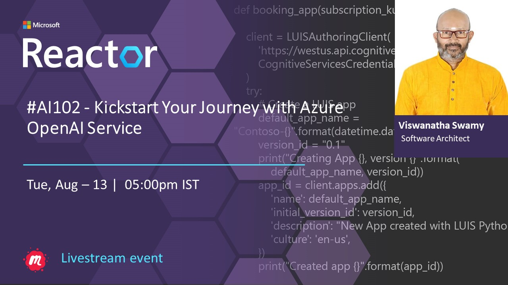
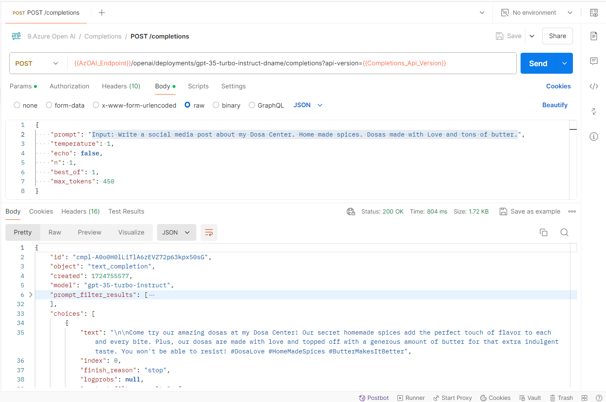

# AI 102 - Mastering Prompt Engineering with Azure OpenAI Service

## Date Time: 27-Aug-2024 at 05:00 PM IST

## Event URL: [https://www.meetup.com/microsoft-reactor-bengaluru/events/302192473](https://www.meetup.com/microsoft-reactor-bengaluru/events/302192473)

## YouTube URL: [https://www.youtube.com/watch?v=FLbuIphXiPY](https://www.youtube.com/watch?v=FLbuIphXiPY)

> 

## MS Learn Modules

> 1. <https://aka.ms/OpenAI.Service>

---

### Software/Tools

> 1. OS: Windows 10/11 x64
> 1. Python / .NET 8
> 1. Visual Studio 2022
> 1. Visual Studio Code

### Prior Knowledge

> 1. Programming knowledge in C# / Python
> 1. Microservices / Distributed applications

## Technology Stack

> 1. NET 8, Python, Azure

## Information


## What are we doing today?

> 1. The Big Picture
>    - Pre-requisites
>    - Previous Session(s)
> 1. What is Prompt Engineering ?
> 1. Components of Effective Prompt Engineering
> 1. Techniques in Prompt Engineering
> 1. Best Practices for Text-Based Prompt Engineering
> 1. Trying our own Completion Examples in Azure AI Studio
> 1. Trying our own Completion Examples using Postman
> 1. Trying our own Completion Examples using `C#`
> 1. SUMMARY / RECAP / Q&A

### Please refer to the [**Source Code**](https://github.com/vishipayyallore/aiml-2024/tree/main/ai102demos) of today's session for more details

---


---

## 1. The Big Picture

### 1.1. Pre-requisites

> 1. Azure Subscription
> 1. .NET 8 / Python

### 1.2. Previous Session(s)

> 1. `Entire playlist` <https://www.youtube.com/playlist?list=PLmsFUfdnGr3wmIh-glyiMkhHS6byEuI59>

## 2. What is Prompt Engineering ?

Prompt engineering is an essential practice when working with language models like those offered by Azure OpenAI. It revolves around the concept of creating, refining, and optimizing input prompts to elicit specific and desired outputs from these models. Here's a breakdown of what it entails:

### Core Concept

At its core, prompt engineering involves carefully crafting the input that you provide to a language model. The aim is to guide the model's output, making it more accurate, relevant, and aligned with the desired outcome.

### Importance

Since language models generate text based on the prompts they receive, the quality, structure, and clarity of the prompt significantly affect the output. This is why prompt engineering is crucial for tasks that require high precision and contextual relevance.

## 3. Components of Effective Prompt Engineering

### Clarity

The prompt should be clear and unambiguous. This ensures that the model understands the task and generates relevant outputs.

### Specificity

Providing detailed instructions within the prompt can help the model focus on what is most important, reducing the likelihood of irrelevant or off-topic responses.

### Context

Adding context to the prompt can significantly improve the model’s ability to generate appropriate responses. Context can include background information, examples, or specific constraints.

### Formatting

Specifying the format of the desired output, such as bullet points, paragraphs, or specific structures, can help guide the model to produce text that is easier to use.

## 4. Techniques in Prompt Engineering

### Example-Based Prompting

Providing examples within the prompt to show the model what kind of response is expected. This can be especially useful for complex tasks.

### Zero-Shot, Few-Shot, and Many-Shot Prompting

These techniques involve giving the model no examples (zero-shot), a few examples (few-shot), or many examples (many-shot) to influence its responses based on the number of provided examples.

### Iterative Refinement

Continuously refining prompts based on the outputs generated by the model. This involves trial and error, where you tweak the prompt to get closer to the desired output.

## 5. Best Practices for Text-Based Prompt Engineering

### Be Explicit

The more explicit and detailed your prompt, the better the model can align its output with your expectations.

### Test and Iterate

Start with a basic prompt and refine it based on the results. Use iterative testing to improve the model’s performance.

### Leverage Context

Whenever possible, include context that can help the model understand the nuances of the task.

### Monitor and Adjust

Regularly monitor the outputs and adjust your prompts to address any inaccuracies or undesired behaviors.

> Prompt engineering in the context of Azure OpenAI is about using these techniques to maximize the efficiency and effectiveness of AI-driven text generation, making it a powerful tool for developers and content creators alike.

## 6. Trying our own Completion Examples in Azure AI Studio

> 1. Discussion and Demo

```text
Input: Please write a Happy Birthday wishes for my Mother

Input: Give the top 5 food items from South India

Input: Give the top 5 Populated states in India

Inputs:
1. Which is the tallest building in the world
2. Which is the tallest building in Hyderabad

Input: Tell me two jokes about simple people

Write a promotional email for a new wildlife rescue, including the following: - Rescue name is Contoso - It specializes in elephants, as well as zebras and giraffes - Call for donations to be given at our website \n Include a list of the current animals we have at our rescue after the signature, in the form of a table. These animals include elephants, zebras, gorillas, lizards, and jackrabbits.
```

## 7. Trying our own Completion Examples using Postman

> 1. Discussion and Demo



## X. Trying our own Completion Examples using `C#`

> 1. Discussion and Demo


---

## SUMMARY / RECAP / Q&A

> 1. SUMMARY / RECAP / Q&A
> 2. Any open queries, I will get back through meetup chat/twitter.

---
