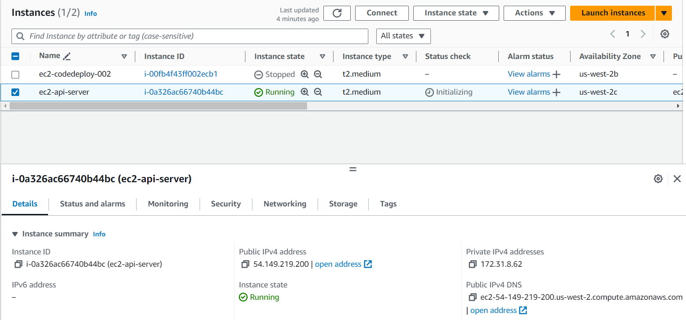

# AWS - Deploy .NET 8 Minimal API on Ubuntu EC2 Nginx

## Date Time: 29-Sep-2024 at 09:00 AM IST

## Event URL: [https://www.meetup.com/dot-net-learners-house-hyderabad/events/301436462](https://www.meetup.com/dot-net-learners-house-hyderabad/events/301436462)

## YouTube URL: [https://www.youtube.com/watch?v=DiTCaNKe-9k](https://www.youtube.com/watch?v=DiTCaNKe-9k)

<!--  -->

---

### Software/Tools

> 1. OS: Windows 10/11 x64
> 1. Python / .NET 8
> 1. Visual Studio 2022
> 1. Visual Studio Code

### Prior Knowledge

> 1. Programming knowledge in C#
> 1. Microservices / Distributed applications
> 1. AWS, CI/CD

## Technology Stack

> 1. .NET 8, C#, AWS, EC2, Nginx

## Information

## What are we doing today?

> 1. The Big Picture
> 1. SUMMARY / RECAP / Q&A

### Please refer to the [**Source Code**](https://github.com/ViswanathaSwamy-PK-TechSkillz-Academy/minimal-apis/tree/main/School) of today's session for more details

---

---

## 1. The Big Picture

> 1. Discussion

## 2. Create a New EC2

> 1. Discussion
> 1. Ubuntu 22.04

## 3. Current Inbound Ports enables

> 1. Discussion
> 1. Port 22, 80 are enabled

## SUMMARY / RECAP / Q&A

> 1. SUMMARY / RECAP / Q&A
> 2. Any open queries, I will get back through meetup chat/twitter.

---
