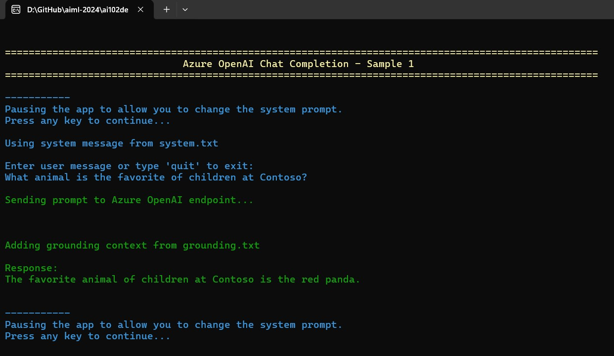

# Deep Dive into Azure AI Studio and Advanced Prompt Engineering (AI 102)

## Date Time: 04-Oct-2024 at 05:00 PM IST

## Event URL: [https://www.meetup.com/aiminds-the-hub-for-ai-intellectuals/events/302926813](https://www.meetup.com/aiminds-the-hub-for-ai-intellectuals/events/302926813)

## YouTube URL: [https://www.youtube.com/watch?v=ToBeDone](https://www.youtube.com/watch?v=ToBeDone)


---

### Software/Tools

> 1. OS: Windows 10/11 x64
> 1. Python / .NET 8
> 1. Visual Studio 2022
> 1. Visual Studio Code

### Prior Knowledge

> 1. Programming knowledge in C# / Python

## Technology Stack

> 1. .NET 8, AI, Open AI

## Information


## What are we doing today?

> 1. The Big Picture
>    - Pre-requisites
>    - Previous Session(s)
> 1. Azure AI Studio Features
> 1. Trying our own Completion Examples in Azure AI Studio
> 1. Trying our own Completion Examples using Postman
> 1. Trying our own Completion Examples using `C#`
> 1. SUMMARY / RECAP / Q&A

### Please refer to the [**Source Code**](https://github.com/vishipayyallore/aiml-2024/tree/main/ai102demos) of today's session for more details

---


---

## 1. The Big Picture

### 1.1. Pre-requisites

> 1. Azure Subscription
> 1. .NET 8 / Python

### 1.2. Previous Session(s)

> 1. <https://www.youtube.com/@DataCouch/videos>

## Azure AI Studio Features

> 1. Discussion and Demo
> 1. Token per minimte
> 1. Total Response Length

## Prompt Engineering Techniques

> 1. Discussion and Demo

### Context in Chat Completions

> 1. Discussion and Demo
> 1. Memory / Context between Completions VS Chat

### Role play

> 1. Discussion and Demo
> 1. `Cardiologist` versus `Assistant`
> 1. Prompt: What is `TV`?

### Zero Shot

> 1. Discussion and Demo

### Single Shot

> 1. Discussion and Demo

### Few Shots

> 1. Discussion and Demo

### CoT

> 1. Chain of Thought (CoT) is a problem-solving approach that involves breaking down a complex problem into a series of smaller, logical steps or intermediate reasoning points. This method helps ensure a clear and systematic progression from the initial conditions to the final solution, enhancing accuracy and understanding by explicitly documenting the thought process at each stage.

```text
Prompt designed to encourage the use of Chain of Thought (CoT) reasoning:

**Prompt:**

"Please solve the following problem using a Chain of Thought (CoT) approach, which involves breaking the problem down into smaller, logical steps to ensure a clear and systematic progression to the solution. Show each intermediate step and explain your reasoning."

Example Problem: "A bakery had 50 cupcakes. They sold 15 in the morning and then baked 20 more in the afternoon. How many cupcakes do they have now?"

**Expected CoT Response:**

1. Start with the initial number of cupcakes: 50.
2. Subtract the number of cupcakes sold in the morning: \( 50 - 15 = 35 \).
3. Add the number of cupcakes baked in the afternoon: \( 35 + 20 = 55 \).
4. The bakery now has 55 cupcakes.

Feel free to use this prompt and example to practice or guide others in using the Chain of Thought approach for problem-solving.
```

## X. Trying our own Completion Examples using `C#`

> 1. Discussion and Demo



## X. Trying our own Completion Examples using `Python`

> 1. Discussion and Demo

## X. Trying our own Completion Examples using Postman

> 1. Discussion and Demo


---

## SUMMARY / RECAP / Q&A

> 1. SUMMARY / RECAP / Q&A
> 2. Any open queries, I will get back through meetup chat/twitter.

---

```text
Q: Roger has 5 tennis balls. He buys 2 more cans of
tennis balls. Each can has 3 tennis balls. How many
tennis balls does he have now?

A: Roger started with 5 balls. 2 cans of 3 tennis balls
each is 6 tennis balls. 5 + 6 = 11. The answer is 11.

Q: The cafeteria had 23 apples. If they used 20 to
make lunch and bought 6 more, how many apples
do they have?
```
