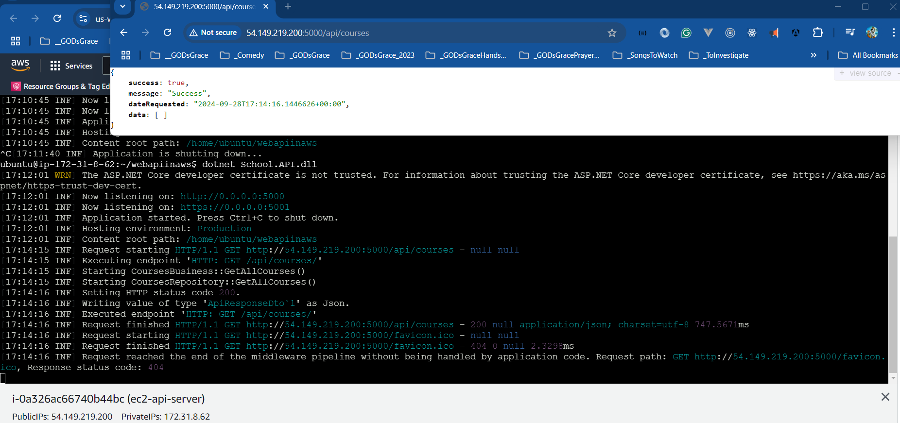

# AWS - Deploying .NET 8 Minimal API on Ubuntu EC2

## Date Time: 17-Nov-2024 at 09:00 AM IST

## Event URL: [https://www.meetup.com/dot-net-learners-house-hyderabad/events/301436430](https://www.meetup.com/dot-net-learners-house-hyderabad/events/301436430)

## YouTube URL: [https://www.youtube.com/watch?v=50xf7fDH97Q](https://www.youtube.com/watch?v=50xf7fDH97Q)

<!--  -->

---

### Software/Tools

> 1. OS: Windows 10/11 x64
> 1. Python / .NET 8
> 1. Visual Studio 2022
> 1. Visual Studio Code

### Prior Knowledge

> 1. Programming knowledge in C#
> 1. Microservices / Distributed applications
> 1. AWS, CI/CD

## Technology Stack

> 1. .NET 8, C#, AWS, EC2, Nginx

## Information


## What are we doing today?

> 1. The Big Picture
> 1. Verifying the .NET 8 Web API on the local box
> 1. Create a New EC2
> 1. Current Inbound Ports enable
> 1. Installing .NET 8 on Ubuntu EC2
> 1. Publish the binaries into the local folder
> 1. Push the binaries into the Ubuntu EC2
> 1. Verify the .NET 8 Web API inside Ubuntu EC2
> 1. Verify the .NET 8 Web API outside Ubuntu EC2
> 1. Execute .NET 8 Web API as a service on Ubuntu EC2
> 1. SUMMARY / RECAP / Q&A

### Please refer to the [**Source Code**](https://github.com/ViswanathaSwamy-PK-TechSkillz-Academy/minimal-apis/tree/main/School) of today's session for more details

---


---

## 1. The Big Picture

> 1. Discussion

## 2. Verifying the .NET 8 Web API on the local box

> 1. Discussion & Demo
> 1. Layered Architecture - All In One


## 3. Create a New EC2

> 1. Discussion
> 1. Ubuntu 22.04


## 4. Current Inbound Ports enable

> 1. Discussion
> 1. Port 22, 80 are enabled


## 5. Installing .NET 8 on Ubuntu EC2

> 1. Discussion & Demo

### Reference(s)

> 1. <https://learn.microsoft.com/en-gb/dotnet/core/install/linux-ubuntu#2004->
> 1. <https://learn.microsoft.com/en-gb/dotnet/core/install/linux-ubuntu-install?pivots=os-linux-ubuntu-2204&tabs=dotnet8>

```bash
sudo apt-get update && \
  sudo apt-get install -y dotnet-sdk-8.0
```


## 6. Publish the binaries into the local folder

> 1. Discussion & Demo


## 7. Push the binaries into the Ubuntu EC2

> 1. Discussion & Demo
> 1. Save the .pem to .ppk if you want to login using Putty.
> 1. Login into EC2 using WinSCP. Use WinSCP to convert PEM to PPK.
> 1. Push the binaries into Ubuntu EC2.


## 8. Verify the .NET 8 Web API inside Ubuntu EC2

> 1. Discussion & Demo
> 1. Execute `dotnet --list-sdks`
> 1. Execute `dotnet School.API.dll --urls "http://localhost:5000"`
> 1. Open another instance of the terminal and execute
> 1. Execute the command to view the port number `netstat -tnlp`


```bash
curl http://localhost:5000
curl http://localhost:5000/api/courses
netstat -tnlp
```


## 9. Verify the .NET 8 Web API outside Ubuntu EC2

<!-- > 1. Update appsettings.json file with the `"urls": "http://0.0.0.0:5000;https://0.0.0.0:5001"`
> 1. `nano appsettings.json`, and `cat appsettings.json` -->

> 1. Discussion & Demo
> 1. Please ensure port `5000`, and `5001` are added inside the Inbound Rules.
> 1. Execute `dotnet School.API.dll --urls "http://0.0.0.0:5000;https://0.0.0.0:5001"`
> 1. Execute the command to view the port number `netstat -tnlp`
> 1. Open the Web Browser and navigate to `http://PublicIP:5000`


```bash
http://54.149.219.200:5000/
http://54.149.219.200:5000/api/courses
```



## 10. Execute .NET 8 Web API as a service on Ubuntu EC2

> 1. Discussion & Demo
> 1. Rename the `urls` to `urlx` inside `appsettings.json` file.
> 1. `nano appsettings.json`, and `cat appsettings.json`
> 1. Create a service file for our Web API

```bash
sudo nano /etc/systemd/system/webapiinaws.service
```

**Note:**

> 1. The service file is created in the /etc/systemd/system folder
> 1. Update the permissions of the service file to 0644
> 1. Update the webapiinaws.service file with the content given below

```bash
[Unit]
Description=.NET 8 Core Web API on Ubuntu

[Service]
WorkingDirectory=/home/ubuntu/webapiinaws
ExecStart=/usr/bin/dotnet /home/ubuntu/webapiinaws/School.API.dll
Restart=always
RestartSec=10
SyslogIdentifier=offershare-web-app
Environment=ASPNETCORE_ENVIRONMENT=Production

[Install]
WantedBy=multi-user.target
```


### Enable the service and run it

```bash
sudo systemctl daemon-reload
sudo systemctl enable webapiinaws.service
sudo systemctl start webapiinaws.service
sudo systemctl status webapiinaws.service
sudo systemctl stop webapiinaws.service
sudo systemctl disable webapiinaws.service

curl -I http://localhost:5000
```


### Few commands for reference

```bash
sudo systemctl daemon-reload
sudo systemctl stop webapiinaws.service
sudo systemctl disable webapiinaws.service
```

## SUMMARY / RECAP / Q&A

> 1. SUMMARY / RECAP / Q&A

---
