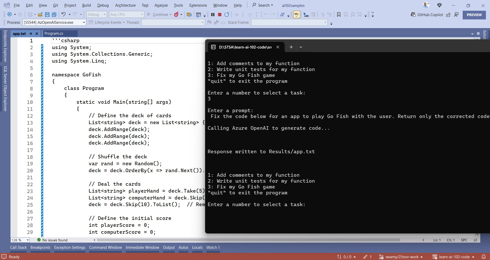
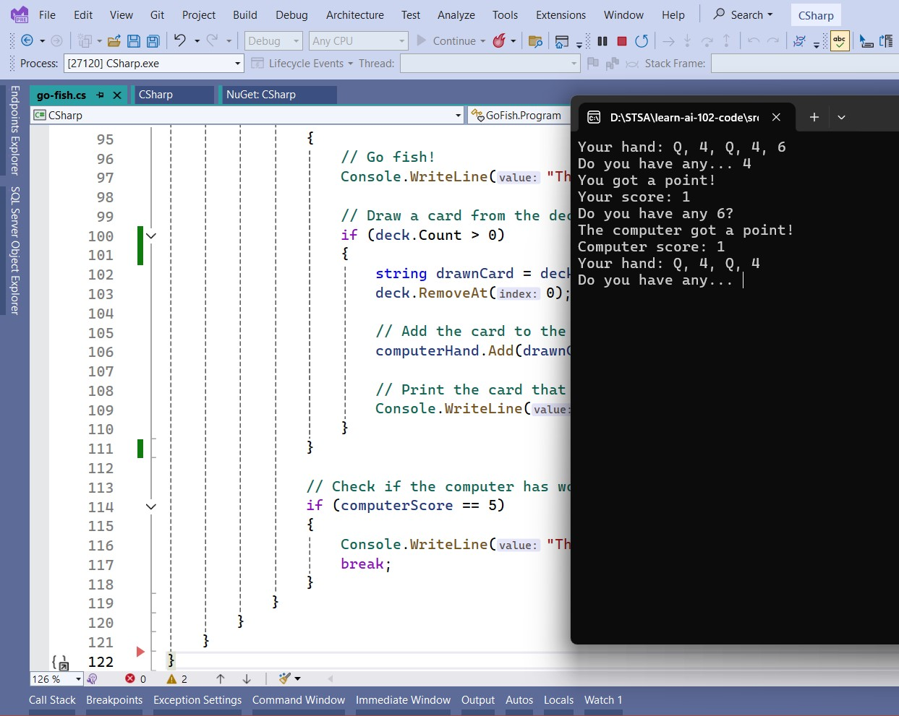

# AI-102 - Generate Code with Azure OpenAI Service

## Date Time: 26-Nov-2024 at 05:00 PM IST

## Event URL: [https://www.meetup.com/microsoft-reactor-bengaluru/events/304141238](https://www.meetup.com/microsoft-reactor-bengaluru/events/304141238)

## YouTube URL: [https://www.youtube.com/watch?v=NFfigXuLt-U](https://www.youtube.com/watch?v=NFfigXuLt-U)


---

### Software/Tools

> 1. OS: Windows 10/11 x64
> 1. Python / .NET 8
> 1. Visual Studio 2022
> 1. Visual Studio Code

### Prior Knowledge

> 1. Programming knowledge in C# / Python

## Technology Stack

> 1. .NET 8, AI, Open AI

## Information


## What are we doing today?

> 1. The Big Picture
>    - Pre-requisites
>    - Previous Session(s)
> 1. SUMMARY / RECAP / Q&A

### Please refer to the [**Source Code**](https://github.com/vishipayyallore/aiml-2024/tree/main/ai102demos) of today's session for more details

---


---

## 1. The Big Picture

### 1.1. Pre-requisites

> 1. Azure Subscription
> 1. .NET 8 / Python

### 1.2. Previous Session(s)

> 1. <https://youtube.com/playlist?list=PLmsFUfdnGr3wmIh-glyiMkhHS6byEuI59&si=5vlmcUqOuWqFiCRR>

### 1.3. Microsoft Learn Module(s)

> 1. <https://aka.ms/Azure-Open-AIService>

## 2. Construct code from natural language

> 1. Discussion and Demo
> 1. Algorithm code in C#, Go, Java, JavaScript, Python, TypeScript

```text
Palindrome Checking Algorithm using Two Pointers in java. Write algo in one file, and main program in another file
```


## 3. Adding comments to the existing code

> 1. Discussion and Demo


## 4. Writing Unit Test cases

> 1. Discussion and Demo


## 5. Fixing the code

> 1. Discussion and Demo





---

## SUMMARY / RECAP / Q&A

> 1. SUMMARY / RECAP / Q&A
> 2. Any open queries, I will get back through meetup chat/twitter.

---
