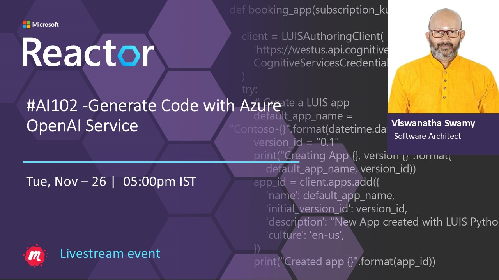
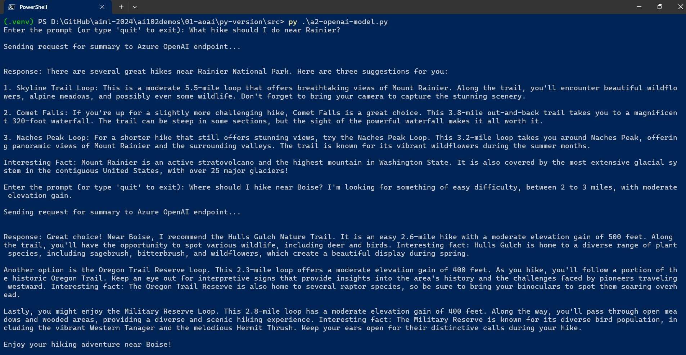

# AI-102 - Generate Code with Azure OpenAI Service

## Date Time: 26-Nov-2024 at 05:00 PM IST

## Event URL: [https://www.meetup.com/microsoft-reactor-bengaluru/events/304141238](https://www.meetup.com/microsoft-reactor-bengaluru/events/304141238)

## YouTube URL: [https://www.youtube.com/watch?v=NFfigXuLt-U](https://www.youtube.com/watch?v=NFfigXuLt-U)



---

### Software/Tools

> 1. OS: Windows 10/11 x64
> 1. Python / .NET 8
> 1. Visual Studio 2022
> 1. Visual Studio Code

### Prior Knowledge

> 1. Programming knowledge in C# / Python

## Technology Stack

> 1. .NET 8, AI, Open AI

## Information


## What are we doing today?

> 1. The Big Picture
>    - Pre-requisites
>    - Previous Session(s)
> 1. SUMMARY / RECAP / Q&A

### Please refer to the [**Source Code**](https://github.com/vishipayyallore/aiml-2024/tree/main/ai102demos) of today's session for more details

---


---

## 1. The Big Picture

### 1.1. Pre-requisites

> 1. Azure Subscription
> 1. .NET 8 / Python

### 1.2. Previous Session(s)

> 1. <https://youtube.com/playlist?list=PLmsFUfdnGr3wmIh-glyiMkhHS6byEuI59&si=5vlmcUqOuWqFiCRR>

### 1.3. Microsoft Learn Module(s)

> 1. <https://aka.ms/Azure-Open-AIService>

## 2. Choose and deploy a model

> 1. Discussion and Demo

### 2.1. Model Families

> 1. Generative Pre-trained Transformer (GPT): Best for natural language understanding, conversations, and chat formats. GPT models handle general tasks across text and some code.
> 1. Code Models (Older versions): Built on GPT-3 or earlier and trained specifically on code. They interpret and generate code effectively based on comments or natural language prompts.
> 1. Embeddings: Designed for specialized data formats, embeddings represent data in a way suitable for similarity matching, clustering, and machine learning applications.

### 2.2. Capabilities of Newer Models

- Newer GPT models, like `gpt-35-turbo`, combine natural language and code understanding within a single model, eliminating the need for a separate code model.

### 2.3. Naming Conventions

- Older models are labeled by task and capability level, e.g., `text-davinci-003` (a text-focused model with "davinci" level capability).
- Newer models specify the generation (e.g., `gpt-35-turbo`), which represents the GPT 3.5 Turbo model.

### 2.4. Model Deployment

- Models are deployed via the **Azure AI Studio**. Go to the **Deployments** page in the Studio to configure the model, as outlined in the lab section of this module.

When deploying an Azure OpenAI model, you assign it a **deployment name** that acts as a unique identifier. This name, along with your **resource endpoint** and **API key**, enables you to specify which deployed model you’re making requests to within your app configuration. Here’s a breakdown of what each element does:

## 3. Authentication and specification of deployed model

- **Resource Endpoint**: This is the URL endpoint for your Azure OpenAI resource, which directs your requests to the Azure environment hosting your models.
- **API Key**: This key authenticates your application, allowing it to securely access the OpenAI resource.
- **Deployment Name**: Specifies the exact model deployment to target within your Azure resource, especially useful when multiple models are deployed within the same resource.

With these configurations, you can seamlessly interact with specific models based on task requirements, making your application adaptable to different tasks by choosing the right model deployment for each request. This setup supports a more efficient and organized approach, particularly if you’re using a variety of models (e.g., GPT-4, embeddings, etc.) for different AI functions.

You can set this up in your application’s configuration settings or codebase, ensuring that each request goes to the appropriate model for optimal performance.

## 4. Prompt Engineering

```text
Classify the following news headline into 1 of the following categories: Business, Tech, Politics, Sport, Entertainment

Headline 1: Donna Steffensen Is Cooking Up a New Kind of Perfection. The Internet’s most beloved cooking guru has a buzzy new book and a fresh new perspective
Category: Entertainment

Headline 2: Major Retailer Announces Plans to Close Over 100 Stores
Category:
```

```json
[
  {
    "role": "system",
    "content": "You are a helpful assistant, teaching people about AI."
  },
  {
    "role": "user",
    "content": "Does Azure OpenAI support multiple languages?"
  },
  {
    "role": "assistant",
    "content": "Yes, Azure OpenAI supports several languages, and can translate between them."
  },
  {
    "role": "user",
    "content": "Do other Azure AI Services support translation too?"
  }
]
```

```json
[
  {
    "role": "system",
    "content": "You are an assistant designed to write intriguing job descriptions. "
  },
  {
    "role": "user",
    "content": "Write a job description for the following job title: 'Business Intelligence Analyst'. It should include responsibilities, required qualifications, and highlight benefits like time off and flexible hours."
  }
]
```

## 5. Use Azure OpenAI REST API

> 1. Discussion and Demo

### Chat Completions


### DALLE


## 6. Trying our own Completion Examples using `Python`

> 1. Discussion and Demo



## 7. Trying our own Completion Examples using `C#`

> 1. Discussion and Demo


---

## SUMMARY / RECAP / Q&A

> 1. SUMMARY / RECAP / Q&A
> 2. Any open queries, I will get back through meetup chat/twitter.

---
