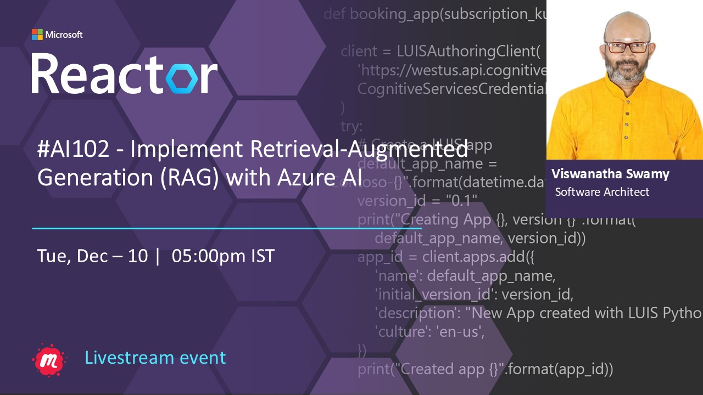
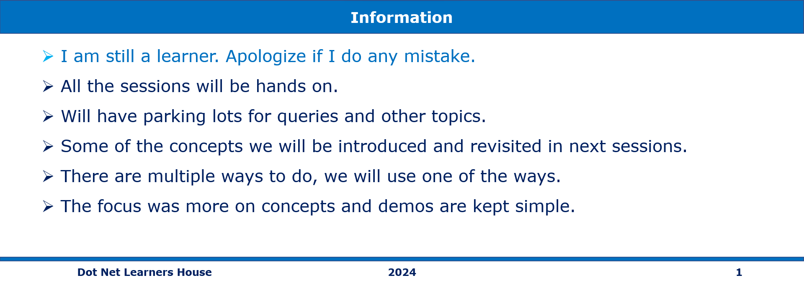
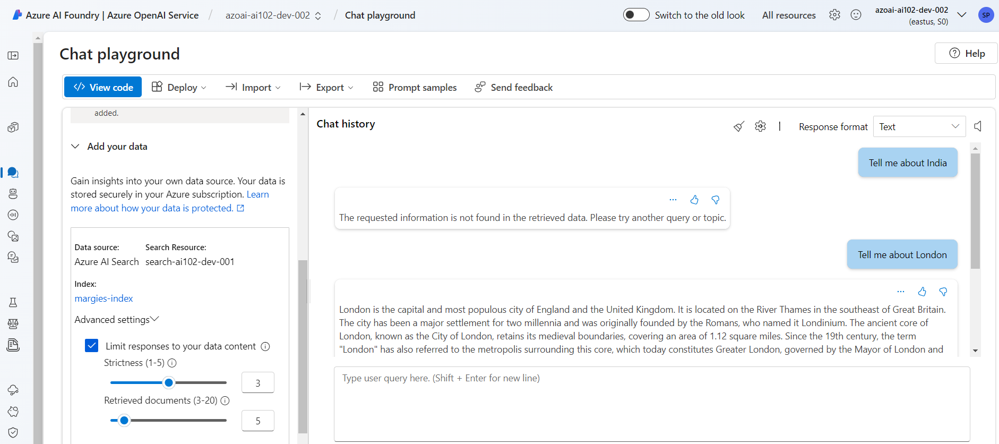

# AI-102 - Implement Retrieval-Augmented Generation (RAG) with Azure OpenAI Service

## Date Time: 10-Dec-2024 at 05:00 PM IST

## Event URL: [https://www.meetup.com/microsoft-reactor-bengaluru/events/304539378](https://www.meetup.com/microsoft-reactor-bengaluru/events/304539378)

## YouTube URL: [https://www.youtube.com/watch?v=cHgZU5dqjyc](https://www.youtube.com/watch?v=cHgZU5dqjyc)



---

### Software/Tools

> 1. OS: Windows 10/11 x64
> 1. Python / .NET 8
> 1. Visual Studio 2022
> 1. Visual Studio Code

### Prior Knowledge

> 1. Programming knowledge in C# / Python

## Technology Stack

> 1. .NET 8, AI, Open AI

## Information



## What are we doing today?

> 1. The Big Picture
>    - Pre-requisites
>    - Previous Session(s)
>    - Microsoft Learn Module(s)
> 1. Retrieval without RAG
> 1. Retrieval Augmented Generation (RAG)
>    - Key Components of RAG
>    - Benefits of RAG
>    - Example Workflow in Azure OpenAI
>    - Use Cases
> 1. Provision Azure Resources
> 1. Upload Your Data
> 1. Deploy AI Models
> 1. Create an Index
> 1. RAG with your data in Azure AI Studio
> 1. RAG with your data in Postman
> 1. Implement RAG with Azure OpenAI Service in `C#`
> 1. SUMMARY / RECAP / Q&A

### Please refer to the [**Source Code**](https://github.com/Swamy-s-Tech-Skills-Academy/learn-ai-102-code) of today's session for more details

---


---

## 1. The Big Picture

### 1.1. Pre-requisites

> 1. Azure Subscription
> 1. .NET 8 / Python

### 1.2. Previous Session(s)

> 1. <https://youtube.com/playlist?list=PLmsFUfdnGr3wmIh-glyiMkhHS6byEuI59&si=5vlmcUqOuWqFiCRR>

### 1.3. Microsoft Learn Module(s)

> 1. <https://aka.ms/OpenAI-RAG>

## 2. Retrieval `without` RAG

> 1. Discussion and Demo

```text
Tell me about India
```


## 3. Retrieval Augmented Generation (RAG)

`Retrieval Augmented Generation (RAG)` is an advanced AI framework that enhances the capabilities of language models by combining `retrieval-based methods` with `generative models`. In essence, RAG integrates external knowledge sources into the generative process, making the model's responses more accurate, up-to-date, and relevant to specific contexts.

### 3.1. Key Components of RAG

#### **Retrieval**

> - RAG systems query an external knowledge base, such as a document store, database, or search engine, to fetch the most relevant information.
> - Tools like Azure Cognitive Search, vector databases, or embeddings-based search mechanisms are often used to identify and retrieve relevant documents or pieces of information.

#### **Augmentation**

> - The retrieved information is used as context for the language model.
> - This augmentation ensures that the model's response is grounded in factual, retrieved data rather than relying solely on its pretrained knowledge.

#### **Generation**

- A generative language model (e.g., Azure OpenAI's GPT models) processes the retrieved context alongside the input query to produce a coherent and informed response.

### 3.2. Benefits of RAG

> 1. **Accuracy**: Ensures responses are based on the most relevant and up-to-date information.
> 1. **Contextual Awareness**: Incorporates domain-specific or private knowledge sources that the model wouldn't have seen during its training.
> 1. **Scalability**: Works well for large-scale deployments where models need to adapt to varied or niche information domains.
> 1. **Cost Efficiency**: Reduces reliance on larger models by leveraging external knowledge effectively.

### 3.3. Example Workflow in Azure OpenAI

> 1. **User Query**: A user asks, _"What are the latest features of Azure OpenAI?"_.
> 1. **Information Retrieval**: The system queries an indexed knowledge base containing Azure OpenAI documentation, release notes, and other materials.
> 1. **Augmented Prompt**: The retrieved documents are appended to the query as part of the prompt.
> 1. **Response Generation**: Azure OpenAI GPT generates a response based on both the query and the retrieved context.

### 3.4. Use Cases

> 1. **Customer Support**: Providing real-time, accurate answers using product manuals or troubleshooting guides.
> 1. **Enterprise Knowledge Management**: Leveraging private, secure repositories to assist employees with organizational knowledge.
> 1. **Research Assistance**: Summarizing and generating insights based on scientific papers or datasets.

## 4. Provision Azure Resources

> 1. Azure OpenAI Resource: For running GPT models.
> 1. Azure AI Search Resource: For indexing and retrieving data.
> 1. Azure Storage Account: For storing your dataset (e.g., brochures).

## 5. Upload Your Data

> 1. Store your data (e.g., PDF brochures) in an Azure Blob Storage container.
> 1. Example: Create a container margies-travel and upload the brochures.

## 6. Deploy AI Models

> 1. Embedding Model (text-embedding-ada-002): Converts text into vectors for indexing.
> 1. Generative Model (gpt-35-turbo-16k): Generates responses using your indexed data.

## 7. Create an Index

> 1. Use Azure AI Search to index the brochures:
>    - Set up a connection to your Blob Storage container.
>    - Use the embedding model to vectorize the text.
>    - Enable semantic ranking for better search relevance.
> 1. Result: A searchable index (margies-index) is created.

## 8. RAG with your data in Azure AI Studio

> 1. Discussion and Demo

```text
System Message: You are a helpful assistant assisting users with travel recommendations.
User: I want to go to New York. Where should I stay?
```



## 9. RAG with your data in Postman

> 1. Discussion and Demo

```text
System Message: You are a helpful assistant assisting users with travel recommendations.
User: I want to go to New York. Where should I stay?
```


## 10. Implement RAG with Azure OpenAI Service in `C#`

> 1. Discussion and Demo

```text
Tell me about Dubai

Tell me about Las Vegas

Tell me about Margies Travel Company

Tell me about London

Tell me about New York

Tell me about San Francisco
```


```text
Tell me about India
```


---

## SUMMARY / RECAP / Q&A

> 1. SUMMARY / RECAP / Q&A
> 2. Any open queries, I will get back through meetup chat/twitter.

---
