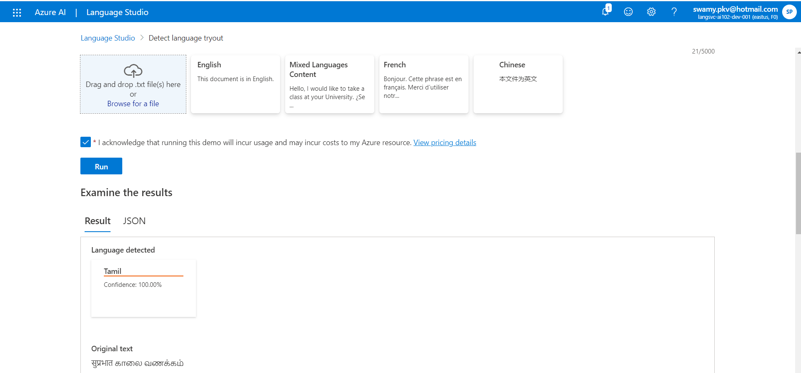
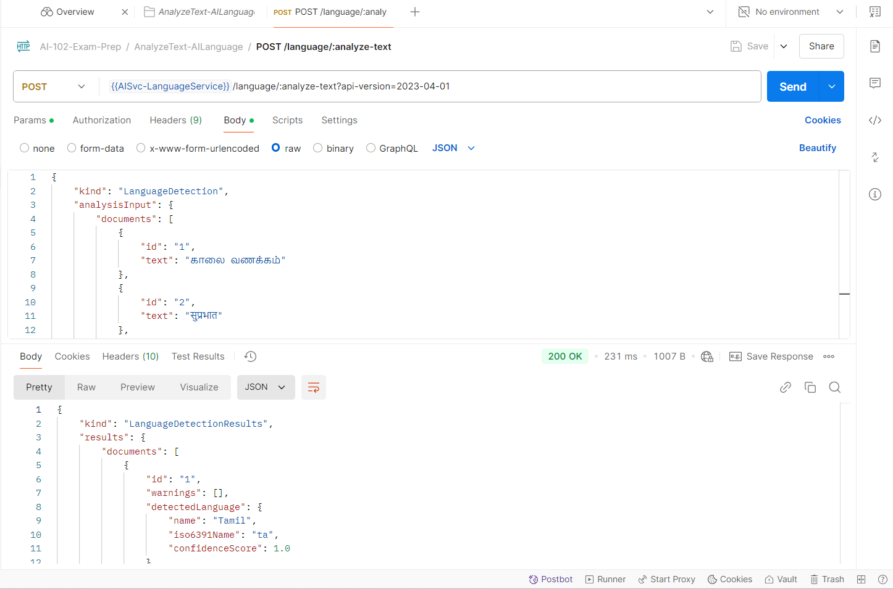
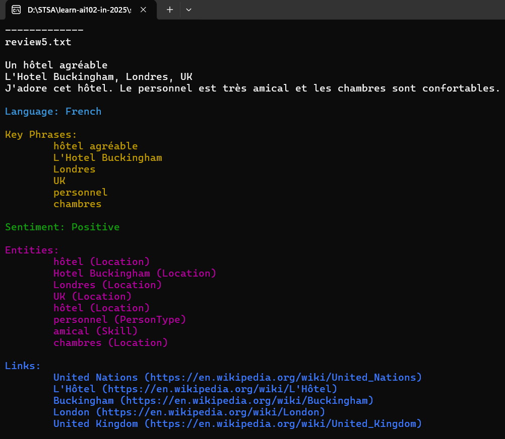

# Text Analysis with Azure AI Language Service (AI 102)

## Date Time: 20-Dec-2024 at 05:00 PM IST

## Event URL: [https://www.meetup.com/aiminds-the-hub-for-ai-intellectuals/events/304762046](https://www.meetup.com/aiminds-the-hub-for-ai-intellectuals/events/304762046)

## YouTube URL: [https://www.youtube.com/@DataCouch/videos](https://www.youtube.com/@DataCouch/videos)

---

### Software/Tools

> 1. OS: Windows 10/11 x64
> 1. Python / .NET 8
> 1. Visual Studio 2022
> 1. Visual Studio Code

### Prior Knowledge

> 1. Programming knowledge in C# / Python

## Technology Stack

> 1. .NET 8, AI, Open AI

## Information

## What are we doing today?

> 1. The Big Picture
>    - Pre-requisites
>    - Previous Session(s)
>    - Microsoft Learn Module(s)
> 1. Provision an Azure AI Language resource
> 1. Started with language detection
> 1. Language studio
> 1. Detect language using Postman
> 1. SUMMARY / RECAP / Q&A

### Please refer to the [**Source Code**](https://github.com/Swamy-s-Tech-Skills-Academy/learn-ai-102-code) of today's session for more details

---

---

## 1. The Big Picture

### 1.1. Pre-requisites

> 1. Azure Subscription
> 1. .NET 8 / Python

### 1.2. Previous Session(s)

> 1. <https://www.youtube.com/@DataCouch/videos>

### 1.3. Microsoft Learn Module(s)

> 1. <https://learn.microsoft.com/en-gb/training/modules/analyze-text-ai-language/>

## 2. Provision an Azure AI Language resource

> 1. Discussion and Demo

## 3. Started with language detection

> 1. Discussion and Demo
> 1. Language studio <https://language.cognitive.azure.com/tryout/detectLanguage>
> 1. Postman (REST API)
> 1. Client library (Azure SDK)
> 1. Docker Containers

## 4. Language studio

> 1. Discussion and Demo
> 1. Language studio <https://language.cognitive.azure.com/tryout/detectLanguage>

## 5. Detect language using Postman

> 1. Discussion and Demo

## 6. Detect language - Azure SDK

> 1. Discussion and Demo

## 7. Extract key phrases

> 1. Discussion and Demo

## 8. Analyze sentiment

> 1. Discussion and Demo

## 9. Extract entities

> 1. Discussion and Demo

## 10. Extract linked entities

> 1. Discussion and Demo

---

## SUMMARY / RECAP / Q&A

> 1. SUMMARY / RECAP / Q&A
> 2. Any open queries, I will get back through meetup chat/twitter.

---
